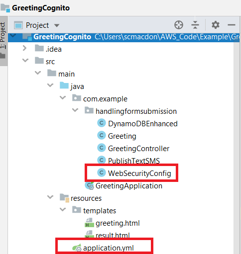
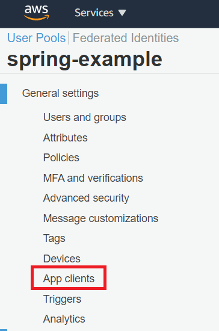

# Securing a Web Application by using Amazon Cognito

Amazon Cognito lets you add user sign-up, sign-in, and access control to your web applications quickly and easily. Amazon Cognito scales to millions of users and supports sign-in with social identity providers, such as Facebook, Google, and Amazon, and enterprise identity providers such as OAuth2. In this AWS tutorial, OAuth2 and Amazon Cognito are used to secure a web application. This means a user has to log into the application by using credentials of a user defined in an Amazon Cognito User Pool. For example, when a user accesses a web application, they see a web page that lets anonymous users view a log in page, as shown in this illustration.   

When the user clicks the log in button, they are presented with a log in form where they can enter their user credentials.

After the user enters their credentials, they can access the web application. 

**Note**: The Spring Boot application used in this AWS tutorial is created by following [Creating your first AWS Java web application](https://github.com/awsdocs/aws-doc-sdk-examples/tree/master/javav2/usecases/creating_first_project). Before following along with this AWS tutorial, you must complete that AWS tutorial. 

The following illustration shows the project files created in this tutorial (most of these files were created by following the tutorial referenced in the previous link). The files circled in red are the new files specific to securing the application by using Amazon Cognito. 

## Prerequisites

To complete the tutorial, you need the following:

+ An AWS account
+ A Java IDE (this example uses IntelliJ)
+ Java 1.8 SDK and Maven
+ Complete the Creating your first AWS Java web application tutorial. 

**Cost to complete:** The AWS services you'll use in this example are part of the [AWS Free Tier](https://aws.amazon.com/free/?all-free-tier.sort-by=item.additionalFields.SortRank&all-free-tier.sort-order=asc).

**Note:** When you're done developing the application, be sure to terminate all of the resources you created to ensure that you're not charged.

**Topics**

+ Update the POM file
+ Create an Amazon Cognito User Pool
+	Define a client application within the User Pool
+	Configure the client application
+	Configure a domain name
+	Create a user
+	Modify your web application

## Update the POM file

The first step in this AWS tutorial is to update the POM file in your project to ensure you have the required dependencies (this is the project you created by following the Creating your first AWS Java web application tutorial). Ensure your project has the following POM dependencies. 

      <?xml version="1.0" encoding="UTF-8"?>
      <project xmlns="http://maven.apache.org/POM/4.0.0"
         xmlns:xsi="http://www.w3.org/2001/XMLSchema-instance"
         xsi:schemaLocation="http://maven.apache.org/POM/4.0.0 http://maven.apache.org/xsd/maven-4.0.0.xsd">
     <modelVersion>4.0.0</modelVersion>
     <groupId>GreetingCognito</groupId>
     <artifactId>GreetingCognito</artifactId>
     <version>1.0-SNAPSHOT</version>
     <parent>
        <groupId>org.springframework.boot</groupId>
        <artifactId>spring-boot-starter-parent</artifactId>
        <version>2.3.0.RELEASE</version>
        <relativePath/> <!-- lookup parent from repository -->
     </parent>
     <properties>
        <project.build.sourceEncoding>UTF-8</project.build.sourceEncoding>
        <java.version>1.8</java.version>
     </properties>
     <dependencyManagement>
        <dependencies>
            <dependency>
                <groupId>software.amazon.awssdk</groupId>
                <artifactId>bom</artifactId>
                <version>2.15.0</version>
                <type>pom</type>
                <scope>import</scope>
            </dependency>
        </dependencies>
     </dependencyManagement>
     <dependencies>
        <dependency>
            <groupId>software.amazon.awssdk</groupId>
            <artifactId>dynamodb-enhanced</artifactId>
            <version>2.11.0-PREVIEW</version>
        </dependency>
        <dependency>
            <groupId>software.amazon.awssdk</groupId>
            <artifactId>dynamodb</artifactId>
         </dependency>
        <dependency>
            <groupId>software.amazon.awssdk</groupId>
            <artifactId>sns</artifactId>
        </dependency>
        <dependency>
            <groupId>org.springframework.boot</groupId>
            <artifactId>spring-boot-starter-web</artifactId>
        </dependency>
        <dependency>
            <groupId>org.springframework.boot</groupId>
            <artifactId>spring-boot-starter-thymeleaf</artifactId>
        </dependency>
        <dependency>
            <groupId>org.springframework.boot</groupId>
            <artifactId>spring-boot-starter-security</artifactId>
        </dependency>
        <dependency>
            <groupId>org.springframework.boot</groupId>
            <artifactId>spring-boot-starter-oauth2-client</artifactId>
        </dependency>
        <dependency>
            <groupId>org.thymeleaf.extras</groupId>
            <artifactId>thymeleaf-extras-springsecurity5</artifactId>
        </dependency>
     </dependencies>
     <build>
        <plugins>
            <plugin>
                <groupId>org.springframework.boot</groupId>
                <artifactId>spring-boot-maven-plugin</artifactId>
            </plugin>
        </plugins>
      </build>
     </project>

## Create an Amazon Cognito User Pool

To successfully secure a web application by using Amazon Cognito, create a User Pool in the AWS Management Console. In this example, create a User Pool named **spring-example**. Once the User Pool is successfully created, you see a confirmation message.

1.	Open the Amazon Cognito console at https://console.aws.amazon.com/cognito/home.

2.	Choose the **Manage User Pools** button. 

3.	Choose the **Create a user pool** button.

4.	In the **Pool name** field, enter **spring-example**. 

5.	Choose **Review Defaults**.

6.	Choose **Create Pool**. 

## Define a client application within the User Pool

Define the client application that can use the User Pool. This is an important step to ensure your web application can use the User Pool to secure a web application. 

1. Choose **App clients** from the menu on the left side. 

2. Choose **Add an app client**.

3. Specify a name for the client application. For example, **spring-boot**.

4. Choose **Create client app**.

5. Write down the generated App client id and App client secret values (you need these values for a later step in this tutorial).

## Configure the client application

You must configure the client application. For example, you need to define the allowed OAuth scope values, as shown in this illustration.

1. Choose **Client app settings** from the menu on the left side. 

2. Choose **Create User**.

3. In the Create user dialog, enter the user name and other information. 

4. Choose **Create user**.

**Note**: The user has a temporary password. The user should define a regular password before logging into an application secured by Amazon Cognito. 

After the user is confirmed, you see the valid users, as shown in this illustration.

At this point, you need the following values to proceed: client id, client secret, pool id value, and the AWS region you are using. Without all of these values, you cannot secure your web application. 

