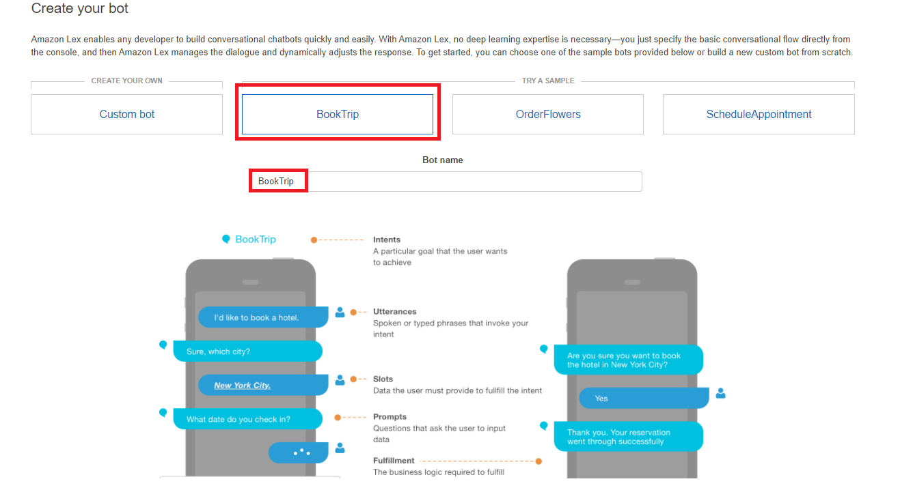

# Using Amazon Lex to engage users within a web application

You can create an Amazon Lex bot within a web application to engage your web site visitors. An Amazon Lex bot is functionality that performs on-line chat conversation with users without providing direct contact with a person. For example, the following illustration shows an Amazon Lex bot that engages a user about a hotel room. 

This AWS tutorial guides you through creating an Amazon Lex box and integrating it into a Spring Boot web application. 

**Cost to complete:** The AWS services included in this document are included in the [AWS Free Tier](https://aws.amazon.com/free/?all-free-tier.sort-by=item.additionalFields.SortRank&all-free-tier.sort-order=asc).

**Note:** Be sure to terminate all of the resources you create while going through this tutorial to ensure that you’re no longer charged for them.

#### Topics

+ Prerequisites
+ Create an IntelliJ project named Greetings
+ Add the Spring POM dependencies to your project
+	Set up the Java packages in your project
+	Create the Java logic for the main Boot class
+	Create the HTML files
+	Package the Greetings application into a JAR file

## Prerequisites

To complete the tutorial, you need the following:

+ An AWS account
+ A Java IDE (this tutorial uses the IntelliJ IDE)
+ Java JDK 1.8
+ Maven 3.6 or later

## Create an Amazon Lex bot

The first step is to create an Amazon Lex bot by using the AWS Management Console. In this example, the Amazon Lex **BookTrip** example is used.

1. Sign in to the AWS Management Console and open the Amazon Lex console at https://console.aws.amazon.com/lex/.

2. On the Bots page, choose **Create**.

3. Choose **BookTrip** blueprint (leave the default bot name **BookTrip**).

4. Choose **Create** (the console shows the **BookTrip** bot). On the Editor tab, review the details of the preconfigured intents (BookCar and BookHotel).

5. Test the bot in the test window. Start the test by typing *I want to book a hotel*. 

**Note**: For more information about the Book Trip example, see [Book Trip](https://docs.aws.amazon.com/lex/latest/dg/ex-book-trip.html).

## Create an Amazon Cognito identity pool

You can use Amazon Cognito to manage permissions for a web application by creating an identity pool. An Amazon Cognito identity pool (federated identities) enables you to create unique identities for your users and federate them with identity providers.

1. Sign in to the AWS Management Console and open the Cognito console at https://console.aws.amazon.com/cognito.

2. Choose **Manage new identity pool**.

3. Choose **Create new identity pool**.

4. Specify a pool name (**examplepool**) and then choose **Enable access to unauthenticated identities**.

5. Choose **Create Pool**.

6. Expand the **Hide Details** section. 

7. Note the AWS Identity and Access Management (IAM) name specified in the **Role Name** field (you need to provide additional permissions to this role). 

