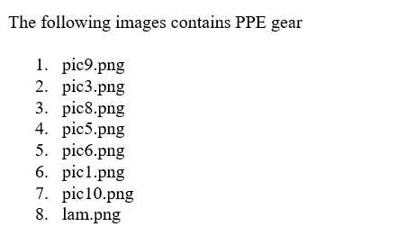
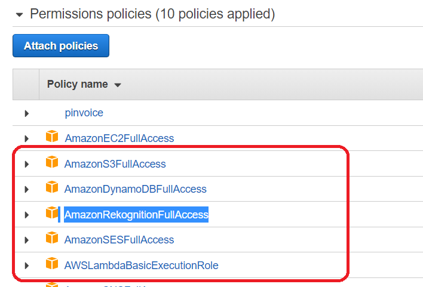
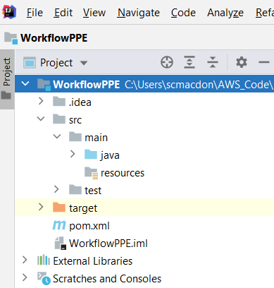

#  Creating an Amazon Web Services Lambda function that detects images with Personal Protective Equipment Equipment

You can create an Amazon Web Services Lambda function that detects personal protective equipment (PPE) gear located in digital assets located in an Amazon Simple Storage Service (Amazon S3) bucket. For example, assume you run the Lambda function and you have this image in an Amazon S3 bucket. 

After you execute the Lambda function, it automatically detects the (PPE) gear in this image (along with any other images) and creates a record in a DynamoDB table. as shown in this illustration.

In addition, this Lambda function creates a list of all images with (PPE) gear and emails the list by using the Simple Email Service, as shown in this illustration. 

As an Amazon Web Services API developer, you can create a Lambda function by using the AWS Lambda Java runtime API. This example invokes different AWS services to perform this specific use case. Lambda is a compute service that enables you to run code without provisioning or managing servers. You can create Lambda functions in various programming languages. For more information about AWS Lambda, see
[What is AWS Lambda](https://docs.aws.amazon.com/lambda/latest/dg/welcome.html).

This tutorial shows you how to use the AWS SDK for Java V2 API to invoke these AWS Services: 

- Amazon S3 service
- Amazon Rekognition service
- Amazon DynamoDB service
- Amazon Simple Email service

The Lambda function reads all objects in a given Amazon S3 bucket. For each object in the bucket, it passes the image to the Amazon Rekognition service to detect PPE gear. The results are stored as records in an Amazon DynamoDB table and then emailed to a recipient.     

**Cost to complete**: The AWS services included in this document are included in the [AWS Free Tier](https://aws.amazon.com/free/?all-free-tier.sort-by=item.additionalFields.SortRank&all-free-tier.sort-order=asc).

**Note**: Be sure to terminate all of the resources after you have completed this tutorial to ensure that you are not charged.

#### Topics
+	Prerequisites
+	Create an AWS Identity and Access Management (IAM) role that is used to execute Lambda functions
+	Create an IntelliJ project
+	Add the POM dependencies to your project
+	Create an AWS Lambda function by using the AWS Lambda runtime API
+	Package the project that contains the AWS Lambda function
+	Deploy the AWS Lambda function

## Prerequisites
To follow along with this tutorial, you need the following:

+ An AWS Account with proper credentials.
+ A Java IDE (for this tutorial, the IntelliJ IDE is used).
+ Java 1.8 JDK.
+ Maven 3.6 or higher.
+ An Amazon S3 bucket with 5-7 PPE images. These images are read by the Lambda function. 

## Create an IAM role that's used to execute Lambda functions

Create the following IAM role:

+ **lambda-support** - Used to invoke Lamdba functions.

This tutorial uses the Amazon Rekognition and Amazon S3 services. The **lambda-support** role has to have policies that enable it to invoke these services from a Lambda function.  

#### To create an IAM role

1. Open the AWS Management Console. When the page loads, enter **IAM** in the search box, and then choose **IAM** to open the IAM console.

2. In the navigation pane, choose **Roles**, and on the **Roles** page, choose **Create Role**.

3. Choose **AWS service**, and then choose **Lambda**.

4. Choose **Permissions**.

5. Search for **AWSLambdaBasicExecutionRole**.

6. Choose **Next Tags**.

7. Choose **Review**.

8. Name the role **lambda-support**.

9. Choose **Create role**.

10. Choose **lambda-support** to view the overview page.

11. Choose **Attach Policies**.

12. Search for **AmazonRekognitionFullAccess**, and then choose **Attach policy**.

13. Search for **AmazonS3FullAccess**, and then choose **Attach policy**. When you're done, you can see the permissions.

## Create an IntelliJ project

1. In the IntelliJ IDE, choose **File**, **New**, **Project**.

2. In the **New Project** dialog box, choose **Maven**, and then choose **Next**.

3. For **GroupId**, enter **WorkflowPPE**.

4. For **ArtifactId**, enter **WorkflowPPE**.

5. Choose **Next**.

6. Choose **Finish**.

## Add the POM dependencies to your project

At this point, you have a new project named **WorkflowTagAssets**.

Make sure that your project's pom.xml file looks like the following.

     <?xml version="1.0" encoding="UTF-8"?>
     <project xmlns="http://maven.apache.org/POM/4.0.0"
         xmlns:xsi="http://www.w3.org/2001/XMLSchema-instance"
         xsi:schemaLocation="http://maven.apache.org/POM/4.0.0 http://maven.apache.org/xsd/maven-4.0.0.xsd">
    <modelVersion>4.0.0</modelVersion>
    <groupId>org.example</groupId>
    <artifactId>WorkflowTagAssets</artifactId>
    <version>1.0-SNAPSHOT</version>
    <packaging>jar</packaging>
    <name>java-basic-function</name>
    <properties>
        <project.build.sourceEncoding>UTF-8</project.build.sourceEncoding>
        <maven.compiler.source>1.8</maven.compiler.source>
        <maven.compiler.target>1.8</maven.compiler.target>
    </properties>
    <dependencyManagement>
        <dependencies>
            <dependency>
                <groupId>software.amazon.awssdk</groupId>
                <artifactId>bom</artifactId>
                <version>2.10.54</version>
                <type>pom</type>
                <scope>import</scope>
            </dependency>
        </dependencies>
    </dependencyManagement>
    <dependencies>
       <dependency>
            <groupId>com.amazonaws</groupId>
            <artifactId>aws-lambda-java-core</artifactId>
            <version>1.2.1</version>
        </dependency>
        <dependency>
            <groupId>com.google.code.gson</groupId>
            <artifactId>gson</artifactId>
            <version>2.8.6</version>
        </dependency>
        <dependency>
            <groupId>org.apache.logging.log4j</groupId>
            <artifactId>log4j-api</artifactId>
            <version>2.10.0</version>
        </dependency>
        <dependency>
            <groupId>org.apache.logging.log4j</groupId>
            <artifactId>log4j-core</artifactId>
            <version>2.13.0</version>
            <scope>test</scope>
        </dependency>
        <dependency>
            <groupId>org.apache.logging.log4j</groupId>
            <artifactId>log4j-slf4j18-impl</artifactId>
            <version>2.13.3</version>
            <scope>test</scope>
        </dependency>
        <dependency>
            <groupId>org.junit.jupiter</groupId>
            <artifactId>junit-jupiter-api</artifactId>
            <version>5.6.0</version>
            <scope>test</scope>
        </dependency>
        <dependency>
            <groupId>org.junit.jupiter</groupId>
            <artifactId>junit-jupiter-engine</artifactId>
            <version>5.6.0</version>
            <scope>test</scope>
        </dependency>
        <dependency>
            <groupId>com.googlecode.json-simple</groupId>
            <artifactId>json-simple</artifactId>
            <version>1.1.1</version>
        </dependency>
        <dependency>
            <groupId>software.amazon.awssdk</groupId>
            <artifactId>s3</artifactId>
        </dependency>
        <dependency>
            <groupId>software.amazon.awssdk</groupId>
            <artifactId>rekognition</artifactId>
        </dependency>
    </dependencies>
    <build>
        <plugins>
            <plugin>
                <artifactId>maven-surefire-plugin</artifactId>
                <version>2.22.2</version>
            </plugin>
            <plugin>
                <groupId>org.apache.maven.plugins</groupId>
                <artifactId>maven-shade-plugin</artifactId>
                <version>3.2.2</version>
                <configuration>
                    <createDependencyReducedPom>false</createDependencyReducedPom>
                </configuration>
                <executions>
                    <execution>
                        <phase>package</phase>
                        <goals>
                            <goal>shade</goal>
                        </goals>
                    </execution>
                </executions>
            </plugin>
            <plugin>
                <groupId>org.apache.maven.plugins</groupId>
                <artifactId>maven-compiler-plugin</artifactId>
                <version>3.8.1</version>
                <configuration>
                    <source>1.8</source>
                    <target>1.8</target>
                </configuration>
            </plugin>
        </plugins>
      </build>
     </project>
    
## Create a Lambda function by using the AWS Lambda runtime Java API

Use the AWS Lambda runtime Java API to create the Java class that defines the Lamdba function. In this example, there is one Java class for the Lambda function named **Handler** and additional classes required for this use case. The following figure shows the Java classes in the project. Notice that all Java classes are located in a package named **com.example.tags**. 

Create these Java classes:

+ **Handler** - uses the Lambda Java run-time API and performs the use case described in this AWS tutorial. The application logic that's executed is located in the **handleRequest** method. 
+ **S3Service** - uses the Amazon S3 API to perform S3 operations.
+ **AnalyzePhotos** - uses the Amazon Rekognition API to analyze the images.
+ **BucketItem** - defines a model that stores Amazon S3 bucket information.
+ **WorkItem** - defines a model that stores Amazon Rekognition data.

### Handler class

This Java code represents the **Handler** class. The class reads a flag that is passed to the Lambda function. The **s3Service.ListBucketObjects** method returns a **List** object where each element is a string value that represents the object key. If the flag value is **true**, then tags are applied by iterating through the list and applying tags to each object by calling the **s3Service.tagAssets** method. If the flag value is **false**, then the **s3Service.deleteTagFromObject** method is invoked that deletes the tags. Also, notice that you can log messages to Amazon CloudWatch logs by using a **LambdaLogger** object.

    package com.example.tags;

    import com.amazonaws.services.lambda.runtime.Context;
    import com.amazonaws.services.lambda.runtime.RequestHandler;
    import com.amazonaws.services.lambda.runtime.LambdaLogger;
    import java.util.ArrayList;
    import java.util.List;
    import java.util.Map;

    public class Handler implements RequestHandler<Map<String,String>, String> {

    @Override
    public String handleRequest(Map<String, String> event, Context context) {
        LambdaLogger logger = context.getLogger();
        String delFag = event.get("flag");
        logger.log("FLAG IS: " + delFag);
        S3Service s3Service = new S3Service();
        AnalyzePhotos photos = new AnalyzePhotos();

        String bucketName = "<Enter your bucket name>";
        List<String> myKeys = s3Service.listBucketObjects(bucketName);
        if (delFag.compareTo("true") == 0) {

            // Create a List to store the data.
            List<ArrayList<WorkItem>> myList = new ArrayList<>();

            // loop through each element in the List and tag the assets.
            for (String key : myKeys) {

                byte[] keyData = s3Service.getObjectBytes(bucketName, key);

                // Analyze the photo and return a list where each element is a WorkItem.
                ArrayList<WorkItem> item = photos.detectLabels(keyData, key);
                myList.add(item);
            }

            s3Service.tagAssets(myList, bucketName);
            logger.log("All Assets in the bucket are tagged!");

        } else {

            // Delete all object tags.
            for (String key : myKeys) {
                s3Service.deleteTagFromObject(bucketName, key);
                logger.log("All Assets in the bucket are deleted!");
            }
         }
        return delFag;
      }
     }

**Note**: Make sure that you assign your bucket name to the **bucketName** variable. 

### AnalyzePhotos class

The following Java code represents the **AnalyzePhotos** class. This class uses the Amazon Rekognition API to analyze the images.

    package com.example.tags;

    import software.amazon.awssdk.auth.credentials.EnvironmentVariableCredentialsProvider;
    import software.amazon.awssdk.core.SdkBytes;
    import software.amazon.awssdk.regions.Region;
    import software.amazon.awssdk.services.rekognition.RekognitionClient;
    import software.amazon.awssdk.services.rekognition.model.Image;
    import software.amazon.awssdk.services.rekognition.model.DetectLabelsRequest;
    import software.amazon.awssdk.services.rekognition.model.DetectLabelsResponse;
    import software.amazon.awssdk.services.rekognition.model.Label;
    import software.amazon.awssdk.services.rekognition.model.RekognitionException;
    import java.util.ArrayList;
    import java.util.List;

    public class AnalyzePhotos {

     // Returns a list of WorkItem objects that contains labels.
     public ArrayList<WorkItem> detectLabels(byte[] bytes, String key) {

        Region region = Region.US_EAST_2;
        RekognitionClient rekClient = RekognitionClient.builder()
                .credentialsProvider(EnvironmentVariableCredentialsProvider.create())
                .region(region)
                .build();

        try {

            SdkBytes sourceBytes = SdkBytes.fromByteArray(bytes);

            // Create an Image object for the source image.
            Image souImage = Image.builder()
                    .bytes(sourceBytes)
                    .build();

            DetectLabelsRequest detectLabelsRequest = DetectLabelsRequest.builder()
                    .image(souImage)
                    .maxLabels(10)
                    .build();

            DetectLabelsResponse labelsResponse = rekClient.detectLabels(detectLabelsRequest);

            // Write the results to a WorkItem instance.
            List<Label> labels = labelsResponse.labels();
            ArrayList<WorkItem> list = new ArrayList<>();
            WorkItem item ;
            for (Label label: labels) {
                item = new WorkItem();
                item.setKey(key); // identifies the photo.
                item.setConfidence(label.confidence().toString());
                item.setName(label.name());
                list.add(item);
            }
            return list;

        } catch (RekognitionException e) {
            System.out.println(e.getMessage());
            System.exit(1);
        }
        return null ;
      }
    }

### BucketItem class

The following Java code represents the **BucketItem** class that stores Amazon S3 object data.

    package com.example.tags;

    public class BucketItem {

     private String key;
     private String owner;
     private String date ;
     private String size ;

     public void setSize(String size) {
        this.size = size ;
     }

     public String getSize() {
        return this.size ;
     }

     public void setDate(String date) {
        this.date = date ;
     }

     public String getDate() {
        return this.date ;
     }

     public void setOwner(String owner) {
        this.owner = owner ;
     }

     public String getOwner() {
        return this.owner ;
     }

     public void setKey(String key) {
        this.key = key ;
     }

     public String getKey() {
        return this.key ;
     }
    }
    
 ### S3Service class
The following class uses the Amazon S3 API to perform S3 operations. For example, the getObjectBytes method returns a byte array that represents the image. 

     package com.example.tags;

     import software.amazon.awssdk.core.ResponseBytes;
     import software.amazon.awssdk.regions.Region;
     import software.amazon.awssdk.services.s3.S3Client;
     import software.amazon.awssdk.services.s3.model.GetObjectRequest;
     import software.amazon.awssdk.services.s3.model.PutObjectTaggingRequest;
     import software.amazon.awssdk.services.s3.model.GetObjectResponse;
     import software.amazon.awssdk.services.s3.model.S3Exception;
     import software.amazon.awssdk.services.s3.model.ListObjectsResponse;
     import software.amazon.awssdk.services.s3.model.S3Object;
     import software.amazon.awssdk.services.s3.model.GetObjectTaggingResponse;
     import software.amazon.awssdk.services.s3.model.ListObjectsRequest;
     import java.util.ArrayList;
     import java.util.List;
     import software.amazon.awssdk.services.s3.model.Tagging;
     import software.amazon.awssdk.services.s3.model.Tag;
     import software.amazon.awssdk.services.s3.model.GetObjectTaggingRequest;
     import software.amazon.awssdk.services.s3.model.DeleteObjectTaggingRequest;

     public class S3Service {

     private S3Client getClient() {

        Region region = Region.US_WEST_2;
        return S3Client.builder()
                .region(region)
                .build();
     }

     public byte[] getObjectBytes(String bucketName, String keyName) {

        S3Client s3 = getClient();

        try {

            GetObjectRequest objectRequest = GetObjectRequest
                    .builder()
                    .key(keyName)
                    .bucket(bucketName)
                    .build();

            // Return the byte[] from this object.
            ResponseBytes<GetObjectResponse> objectBytes = s3.getObjectAsBytes(objectRequest);
            return objectBytes.asByteArray();

        } catch (S3Exception e) {
            System.err.println(e.awsErrorDetails().errorMessage());
            System.exit(1);
        }
        return null;
     }

     // Returns the names of all images in the given bucket.
     public List<String> listBucketObjects(String bucketName) {

        S3Client s3 = getClient();
        String keyName;

        List<String> keys = new ArrayList<>();

        try {
            ListObjectsRequest listObjects = ListObjectsRequest
                    .builder()
                    .bucket(bucketName)
                    .build();

            ListObjectsResponse res = s3.listObjects(listObjects);
            List<S3Object> objects = res.contents();

            for (S3Object myValue: objects) {
                keyName = myValue.key();
                keys.add(keyName);
            }
            return keys;

        } catch (S3Exception e) {
            System.err.println(e.awsErrorDetails().errorMessage());
            System.exit(1);
        }
        return null;
     }

     // tag assets with labels in the given list.
     public void tagAssets(List myList, String bucketName) {

        try {

            S3Client s3 = getClient();
            int len = myList.size();

            String assetName = "";
            String labelName = "";
            String labelValue = "";

            // tag all the assets in the list.
            for (Object o : myList) {

                //Need to get the WorkItem from each list.
                List innerList = (List) o;
                for (Object value : innerList) {

                    WorkItem workItem = (WorkItem) value;
                    assetName = workItem.getKey();
                    labelName = workItem.getName();
                    labelValue = workItem.getConfidence();
                    tagExistingObject(s3, bucketName, assetName, labelName, labelValue);
                }
            }

        } catch (S3Exception e) {
            System.err.println(e.awsErrorDetails().errorMessage());
            System.exit(1);
        }
     }

     // This method tags an existing object.
     private void tagExistingObject(S3Client s3, String bucketName, String key, String label, String LabelValue) {

        try {

            // First need to get existing tag set; otherwise the existing tags are overwritten.
            GetObjectTaggingRequest getObjectTaggingRequest = GetObjectTaggingRequest.builder()
                    .bucket(bucketName)
                    .key(key)
                    .build();

            GetObjectTaggingResponse response = s3.getObjectTagging(getObjectTaggingRequest);

            // Get the existing immutable list - cannot modify this list.
            List<Tag> existingList = response.tagSet();
            ArrayList<Tag> newTagList = new ArrayList(new ArrayList<>(existingList));

            // Create a new tag.
            Tag myTag = Tag.builder()
                    .key(label)
                    .value(LabelValue)
                    .build();

            // push new tag to list.
            newTagList.add(myTag);
            Tagging tagging = Tagging.builder()
                    .tagSet(newTagList)
                    .build();

            PutObjectTaggingRequest taggingRequest = PutObjectTaggingRequest.builder()
                    .key(key)
                    .bucket(bucketName)
                    .tagging(tagging)
                    .build();

            s3.putObjectTagging(taggingRequest);
            System.out.println(key + " was tagged with " + label);

        } catch (S3Exception e) {
            System.err.println(e.awsErrorDetails().errorMessage());
            System.exit(1);
        }
      }

     //Delete tags from the given object.
     public void deleteTagFromObject(String bucketName, String key) {

        try {

            DeleteObjectTaggingRequest deleteObjectTaggingRequest = DeleteObjectTaggingRequest.builder()
                    .key(key)
                    .bucket(bucketName)
                    .build();

            S3Client s3 = getClient();
            s3.deleteObjectTagging(deleteObjectTaggingRequest);

        } catch (S3Exception e) {
            System.err.println(e.awsErrorDetails().errorMessage());
            System.exit(1);
        }
      }
    }

### WorkItem class
The following Java code represents the **WorkItem** class.

     package com.example.tags;

     public class WorkItem {

     private String key;
     private String name;
     private String confidence ;

    public void setKey (String key) {
        this.key = key;
    }

    public String getKey() {
        return this.key;
    }

    public void setName (String name) {
        this.name = name;
    }

    public String getName() {
        return this.name;
    }

    public void setConfidence (String confidence) {
        this.confidence = confidence;
    }

    public String getConfidence() {
        return this.confidence;
    }
   }

## Package the project that contains the Lambda functions

Package up the project into a .jar (JAR) file that you can deploy as a Lambda function by using the following Maven command.

    mvn package

The JAR file is located in the **target** folder (which is a child folder of the project folder).

**Note**: Notice the use of the **maven-shade-plugin** in the project’s POM file. This plugin is responsible for creating a JAR that contains the required dependencies. If you attempt to package up the project without this plugin, the required dependences are not included in the JAR file and you will encounter a **ClassNotFoundException**. 

## Deploy the Lambda function

1. Open the Lambda console at https://us-east-1.console.aws.amazon.com/lambda/home.

2. Choose **Create Function**.

3. Choose **Author from scratch**.

4. In the **Basic** information section, enter **cron** as the name.

5. In the **Runtime**, choose **Java 8**.

6. Choose **Use an existing role**, and then choose **lambda-support** (the IAM role that you created).

7. Choose **Create function**.

8. For **Code entry type**, choose **Upload a .zip or .jar file**.

9. Choose **Upload**, and then browse to the JAR file that you created.  

10. For **Handler**, enter the fully qualified name of the function, for example, **com.example.tags.Handler:handleRequest** (**com.example.tags** specifies the package, **Handler** is the class followed by :: and method name).

11. Choose **Save.**

### Test the Lambda method

At this point in the tutorial, you can test the Lambda function. Click the **Test** tab and then enter the following JSON.

     {
    "flag": "true"
     }

**Note**: Passing **true** tags the digital assets and passing **false** deletes the tags. 

Choose the **Invoke** button. After the Lambda function is invoked, you see a successful message. 

### Next steps
Congratulations, you have created an AWS Lambda function that automactially applies tags to difital assets located in an Amazon S3 bucket.As stated at the beginning of this tutorial, be sure to terminate all of the resources you created while going through this tutorial to ensure that you’re not charged.

For more AWS multiservice examples, see
[usecases](https://github.com/awsdocs/aws-doc-sdk-examples/tree/master/javav2/usecases).

