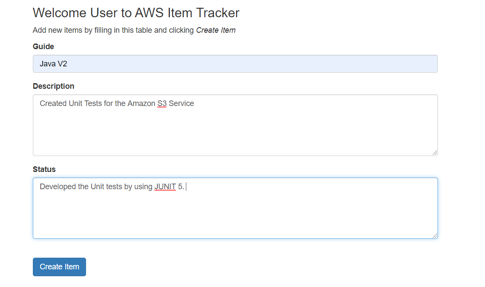
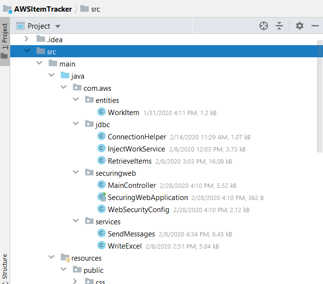
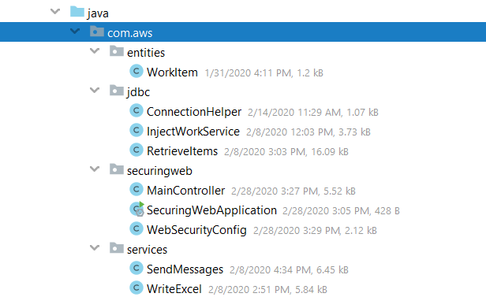
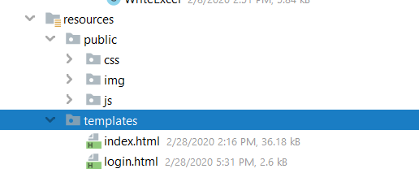
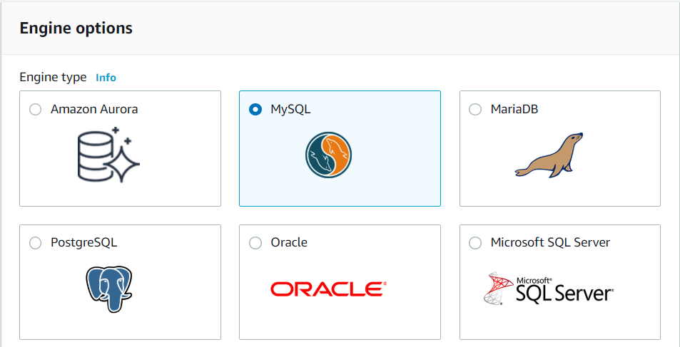
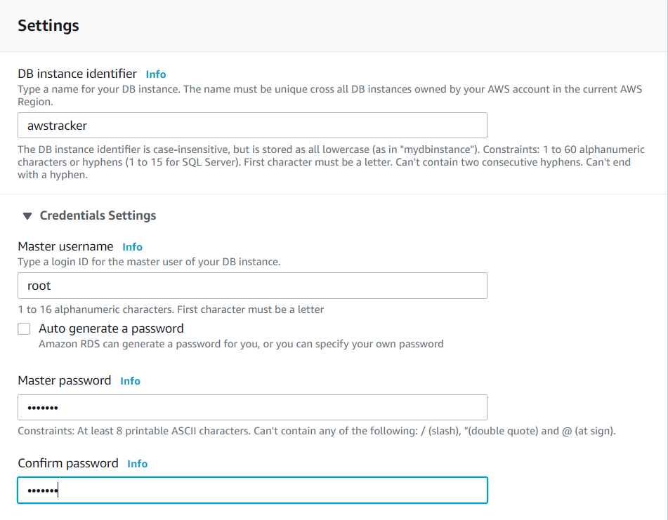
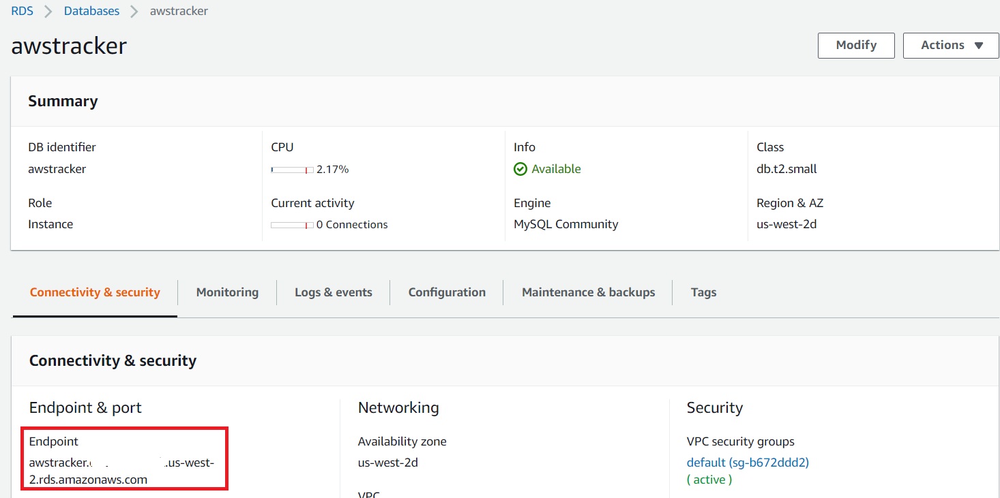
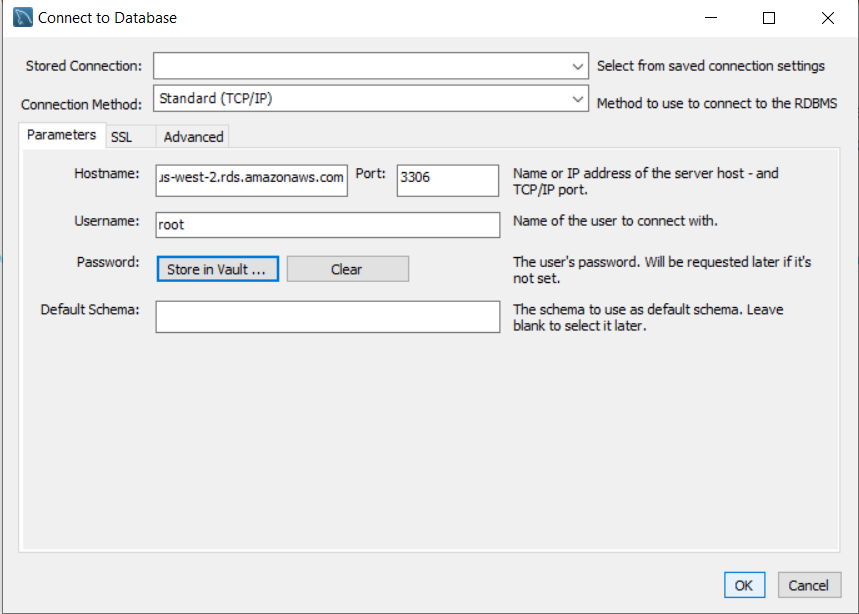
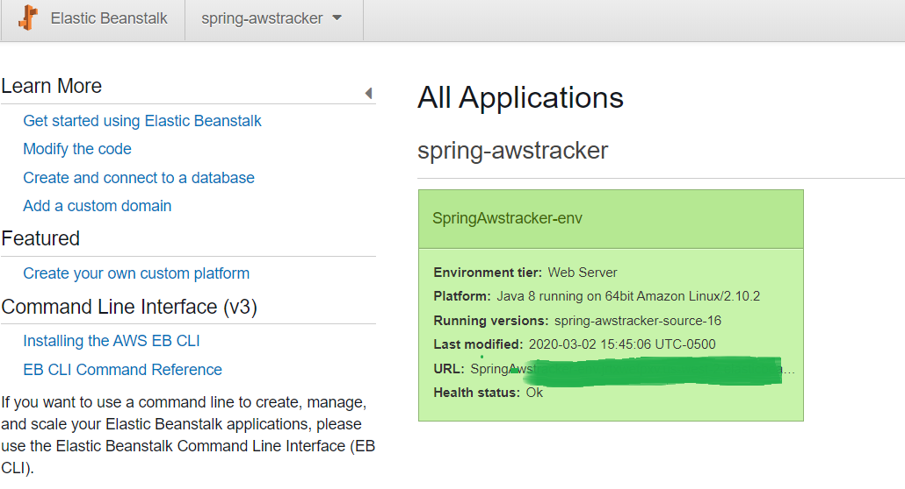
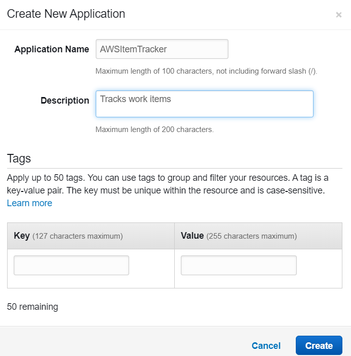

#  Creating a Secure AWS Tracking Application using Spring Boot and AWS Services

You can develop an Amazon Web Serice (AWS) application that tracks and reports on work items by using these Amazon Web Services: 

+ Amazon Relational Database Service (RDS)
+ Amazon Simple Email Service (SES)
+ AWS Elastic Beanstalk

In addition, the *AWS Tracking* application uses Spring Boot APIs to build a model, views, and a controller. The *AWS Tracking* application is a secure web application that uses Spring Boot Security and requires a user to log into the application. For more information, see https://www.tutorialspoint.com/spring_boot/spring_boot_securing_web_applications.htm. 

This application uses a model that is based on a work item and contains these attributes: 

+ **date** - the start date of the item 
+ **description** - the description of the item
+ **guide** - the deliverable that is impacted by the item 
+ **username** - the person whom performs the work item
+ **status** - the status of the item 
+ **archive** - whether this item is completed or still being worked on

The following illustration shows the login page. 

After a user logs into the system, they can perform these tasks: 

+ Enter a new item into the system.
+ View all active items.
+ View archived items that have been completed. 
+ Modify active items.
+ Send a report to an email recipient. 

The following illustration shows the new item section of the application. 

A user can retrieve either *active* or *archive* items. For example, a user can click the **Get Active Items** button to get a result set of active items. A data set is retrieved from an Amazon RDS database and displayed in the web application, as shown in this illustration. 

The database is MySQL and contains a table named **work** that contains these fields:

+ **idwork** - A VARCHAR(45) value that represents the PK. 
+ **date** - a Date value that specifies the date the item was created
+ **description** - a VARCHAR(400) that describes the item 
+ **guide** - a VARCHAR(45) value that represents the deliverable being worked on
+ **status** - a  VARCHAR(400) value that describes describes the status
+ **username** - a VARCHAR(45) value that represents the user whom entered the item 
+ **archive** - a TINYINT(4)value that represents whether this is an active or archive item 

The following illustration shows the **work** table. 

Finally, the user can select the email recipient from the **Select Manager** dropdown field and click the **Send Report** button. All active items are placed into a data set and used to dynamically create an Excel document by using the **jxl.write.WritableWorkbook** API. Then the application uses Amazon SES to email the document to the selected email recipient. The following illustration shows an example of a report. 

This development document guides you through creating the *AWS Tracker* application. Once the application is developed, this document teaches you how to deploy it to the AWS Elastic Beanstalk.

The following illustration shows you the structure of the Java project that you create by following this development document.

**Note**: All of the Java code required to complete this document is located in this Github repository. 

To follow along with the document, you require the following:

+ An AWS Account.
+ A Java IDE (for this development document, the IntelliJ IDE is used).
+ Java 1.8 JDK 
+ Maven 3.6 or higher.

**Cost to Complete**: The AWS Services included in this document are included in the AWS Free Tier.

**Note**: Please be sure to terminate all of the resources created during this document to ensure that you are no longer charged.

This document contains the following sections: 

+ Create an IntelliJ project named AWSItemTracker
+ Add the Spring POM dependencies to your project	
+ Setup the Java packages in your project
+ Create the Java logic for a secure web application
+ Create the main controller class
+ Create the WorkItem class
+ Create the JDBC Classes
+ Create the Service classes
+ Create the HTML files
+ Create a Script file that performs AJAX requests 
+ Create a JAR file for the AWS Tracker application 
+ Setup the RDS instance 
+ Deploy the application to the AWS Elastic Beanstalk

## Create an IntelliJ project named AWSItemTracker

**Create a new IntelliJ project named AWSItemTracker**

1. From within the IntelliJ IDE, click **File**, **New**, **Project**. 
2. In the **New Project** dialog, select **Maven**. 
3. Click **Next**.
4. In the **GroupId** field, enter **spring-aws**. 
5. In the **ArtifactId** field, enter **AWSItemTracker**. 
6. Click **Next**.
7. Click **Finish**. 

## Add the Spring POM dependencies to your project

At this point, you have a new project named **AWSItemTracker**, as shown in this illustration. 

Inside the **project** element in the **pom.xml** file, add the **spring-boot-starter-parent** dependency:
  
     <parent>
        <groupId>org.springframework.boot</groupId>
        <artifactId>spring-boot-starter-parent</artifactId>
        <version>2.0.4.RELEASE</version>
        <relativePath /> <!-- lookup parent from repository -->
    </parent>
    
Also, add the following Spring Boot **dependency** elements inside the **dependencies** element.

    <dependency>
			<groupId>org.springframework.boot</groupId>
			<artifactId>spring-boot-starter-thymeleaf</artifactId>
		</dependency>
		<dependency>
			<groupId>org.springframework.boot</groupId>
			<artifactId>spring-boot-starter-web</artifactId>
		</dependency>
		 <dependency>
			<groupId>org.springframework.boot</groupId>
			<artifactId>spring-boot-starter-test</artifactId>
			<scope>test</scope>
			<exclusions>
				<exclusion>
					<groupId>org.junit.vintage</groupId>
					<artifactId>junit-vintage-engine</artifactId>
				</exclusion>
			</exclusions>
		  </dependency>
      
In addition, you need to add these DynamoDB API dependencies. 

    <dependencyManagement>
	    	<dependencies>
			  <dependency>
				  <groupId>software.amazon.awssdk</groupId>
				  <artifactId>bom</artifactId>
				  <version>2.10.54</version>
				  <type>pom</type>
				<scope>import</scope>
			</dependency>
		  </dependencies>
	  </dependencyManagement>
    
    <dependency>
			<groupId>software.amazon.awssdk</groupId>
			<artifactId>dynamodb-enhanced</artifactId>
			<version>2.10.84-PREVIEW</version>
		</dependency>
		<dependency>
			<groupId>software.amazon.awssdk</groupId>
			<artifactId>dynamodb</artifactId>
			<version>2.5.10</version>
		</dependency>
    
**Note** - Ensure that you are using Java 1.8 (shown below).
  
At this point, the **pom.xml** file resembles the following file. 

    <?xml version="1.0" encoding="UTF-8"?>
    <project xmlns="http://maven.apache.org/POM/4.0.0"
         xmlns:xsi="http://www.w3.org/2001/XMLSchema-instance"
         xsi:schemaLocation="http://maven.apache.org/POM/4.0.0 http://maven.apache.org/xsd/maven-4.0.0.xsd">
    <modelVersion>4.0.0</modelVersion>
    <groupId>spring-aws</groupId>
    <artifactId>Greetings</artifactId>
    <version>1.0-SNAPSHOT</version>
    <parent>
        <groupId>org.springframework.boot</groupId>
        <artifactId>spring-boot-starter-parent</artifactId>
        <version>2.2.5.RELEASE</version>
        <relativePath/> <!-- lookup parent from repository -->
    </parent>

    <properties>
        <java.version>1.8</java.version>
    </properties>
    <dependencyManagement>
        <dependencies>
            <dependency>
                <groupId>software.amazon.awssdk</groupId>
                <artifactId>bom</artifactId>
                <version>2.10.54</version>
                <type>pom</type>
                <scope>import</scope>
            </dependency>
        </dependencies>
    </dependencyManagement>
    <dependencies>
        <dependency>
            <groupId>org.springframework.boot</groupId>
            <artifactId>spring-boot-starter-thymeleaf</artifactId>
        </dependency>
        <dependency>
            <groupId>org.springframework.boot</groupId>
            <artifactId>spring-boot-starter-web</artifactId>
        </dependency>
        <dependency>
            <groupId>org.springframework.boot</groupId>
            <artifactId>spring-boot-starter-test</artifactId>
            <scope>test</scope>
            <exclusions>
                <exclusion>
                    <groupId>org.junit.vintage</groupId>
                    <artifactId>junit-vintage-engine</artifactId>
                </exclusion>
            </exclusions>
        </dependency>
        <dependency>
            <groupId>software.amazon.awssdk</groupId>
            <artifactId>dynamodb-enhanced</artifactId>
            <version>2.10.84-PREVIEW</version>
        </dependency>
        <dependency>
            <groupId>software.amazon.awssdk</groupId>
            <artifactId>dynamodb</artifactId>
            <version>2.5.10</version>
        </dependency>
      </dependencies>
      <build>
        <plugins>
            <plugin>
                <groupId>org.springframework.boot</groupId>
                <artifactId>spring-boot-maven-plugin</artifactId>
            </plugin>
        </plugins>
      </build>
    </project>

## Setup the Java packages in your project

Create a Java package in the **main/java** folder named **com.aws**. 

The Java files go into these subpackages:

The following list describes these packages:

+ **entities** - contains Java files that represent the model. In this example, the model class is named **WorkItem**. 
+ **jdbc** - contains Java files that use the JDBC API to interact with the RDS database.
+ **services** - contains Java files that invoke AWS Services. For example, the  **com.amazonaws.services.simpleemail.AmazonSimpleEmailService** is used within a Java file to send email messages.
+ **securingweb** - contains all of the Java files required for Spring Security. 

## Create the Java logic for a secure web application

Create Spring Security application logic that secures the web application with a login form that requires a user to provide credentials. In this application, a Java class sets up an in-memory user store that contains a single user (the user name is **user** and the password is **password**.)

**NOTE** - For more information about Spring Security, see https://spring.io/guides/gs/securing-web/. 

### Create the Spring Security classes

Create a new Java package named **com.aws.securingweb**. Next, create these classes in this package:

+ **SecuringWebApplication** 
+ **WebSecurityConfig**

#### SecuringWebApplication class 
The following Java code represents the **SecuringWebApplication** class.

    package com.aws.securingweb;

    import org.springframework.boot.SpringApplication;
    import org.springframework.boot.autoconfigure.SpringBootApplication;

    @SpringBootApplication
    public class SecuringWebApplication {

    public static void main(String[] args) throws Throwable {
        SpringApplication.run(SecuringWebApplication.class, args);
     }
    }

#### WebSecurityConfig class 
The following Java code represents the **WebSecurityConfig** class.

    package com.aws.securingweb;

    import org.springframework.context.annotation.Bean;
    import org.springframework.context.annotation.Configuration;
    import org.springframework.security.config.annotation.web.builders.HttpSecurity;
    import org.springframework.security.config.annotation.web.configuration.EnableWebSecurity;
    import org.springframework.security.config.annotation.web.configuration.WebSecurityConfigurerAdapter;
    import org.springframework.security.core.userdetails.User;
    import org.springframework.security.core.userdetails.UserDetails;
    import org.springframework.security.core.userdetails.UserDetailsService;
    import org.springframework.security.provisioning.InMemoryUserDetailsManager;
    import org.springframework.security.web.util.matcher.AntPathRequestMatcher;

    @Configuration
    @EnableWebSecurity
    public class WebSecurityConfig extends WebSecurityConfigurerAdapter {
     @Override
    protected void configure(HttpSecurity http) throws Exception {
        http
                .authorizeRequests()
                .antMatchers(
                        "/js/**",
                        "/css/**",
                        "/img/**",
                        "/webjars/**").permitAll()
                .anyRequest().authenticated()
                .and()
                .formLogin()
                .loginPage("/login")
                .permitAll()
                .and()
                .logout()
                .invalidateHttpSession(true)
                .clearAuthentication(true)
                .logoutRequestMatcher(new AntPathRequestMatcher("/logout"))
                .logoutSuccessUrl("/login?logout")
                .permitAll();

        http.csrf().disable();
    }

    @Bean
    @Override
    public UserDetailsService userDetailsService() {
        UserDetails user =
                User.withDefaultPasswordEncoder()
                        .username("user")
                        .password("password")
                        .roles("USER")
                        .build();

        return new InMemoryUserDetailsManager(user);
     }
    }
   
 **Note** - In this example, the user credentials to log into the application are user/password.  
 
#### Create the SecuringWebApplication and WebSecurityConfig classes 

1. Create the **com.aws.securingweb** package. 
2. Create the **SecuringWebApplication** class in this package and paste the code into it.
3. Create the **WebSecurityConfig** class in this package and paste the code into it.

## Create the main controller class

Within the **com.aws.securingweb** package, create the controller class named **MainController**. This class is responsible for handling the HTTP Requests. For example, if a GET operation is made by the view, the **MainController** handles this request and returns a data set that is displayed in the view. In this example, the data set is obtained from the MySQL database located in the AWS Cloud. 

**NOTE**: In this application, AJAX request are made to invoke controller methods. The syntax of the AJAX request are shown later in this document. 

#### MainController class

The following Java code represents the **MainController** class. 

    package com.aws.securingweb;

    import com.aws.entities.WorkItem;
    import com.aws.jdbc.RetrieveItems;
    import org.springframework.security.core.context.SecurityContextHolder;
    import org.springframework.stereotype.Controller;
    import org.springframework.ui.Model;
    import org.springframework.web.bind.annotation.*;
    import com.aws.jdbc.InjectWorkService;
    import com.aws.services.WriteExcel;
    import com.aws.services.SendMessages;
    import javax.servlet.http.HttpServletRequest;
    import javax.servlet.http.HttpServletResponse;
    import java.util.List;

    @Controller
    public class MainController {

    @GetMapping("/")
    public String root() {
        return "index";
    }

    @GetMapping("/login")
    public String login(Model model) {
        return "login";
    }

    //This is invoked when we want to build a report
    @RequestMapping(value = "/report", method = RequestMethod.GET)
    @ResponseBody
    String getReport(HttpServletRequest request, HttpServletResponse response) {

        //Get the work item list
        //Get the Logged in User
        org.springframework.security.core.userdetails.User user2 = (org.springframework.security.core.userdetails.User) SecurityContextHolder.getContext().getAuthentication().getPrincipal();
        String name = user2.getUsername();
        RetrieveItems ri = new RetrieveItems();
        List<WorkItem> theList =  ri.getItemsDataSQLReport(name);

        WriteExcel writeExcel = new WriteExcel();
        SendMessages sm = new SendMessages();
        java.io.InputStream is = writeExcel.exportExcel(theList);

        try {
            //copyInputStreamToFile(is, testFile);
            sm.SendReport(is);
        }
        catch (Exception e){
            e.getStackTrace();
        }
        return "Report is created";
    }

    //This is invoked when we want to change the value of a work item
    @RequestMapping(value = "/archive", method = RequestMethod.POST)
    @ResponseBody
    String ArchieveWorkItem(HttpServletRequest request, HttpServletResponse response) {
        String id = request.getParameter("id");

        RetrieveItems ri = new RetrieveItems();
        WorkItem item= ri.GetWorkItembyId(id);
        // db.injectDynamoItem(item);
        ri.FlipItemArchive(id );
        return id ;
    }

    //This is invoked when we want to change the value of a work item
    @RequestMapping(value = "/changewi", method = RequestMethod.POST)
    @ResponseBody
    String ChangeWorkItem(HttpServletRequest request, HttpServletResponse response) {
        String id = request.getParameter("id");
        String description = request.getParameter("description");
        String status   = request.getParameter("status");

        InjectWorkService ws = new InjectWorkService();
        return ws.modifySubmission(id, description, status) ;
    }

    //This is invoked when we retrieve all items for a given writer
    @RequestMapping(value = "/retrieve", method = RequestMethod.GET)
    @ResponseBody
    String retrieveItems(HttpServletRequest request, HttpServletResponse response) {

        //Get the Logged in User
        org.springframework.security.core.userdetails.User user2 = (org.springframework.security.core.userdetails.User) SecurityContextHolder.getContext().getAuthentication().getPrincipal();
        String name = user2.getUsername();

        RetrieveItems ri = new RetrieveItems();

        String type = request.getParameter("type");
        //Pass back all data from WOrk table

        if (type.equals("active"))
            return ri.getItemsDataSQL(name) ;
        else
            return ri.getArchiveData(name) ;
    }

    //This is invoked when we want to return a work item to modify
    @RequestMapping(value = "/modify", method = RequestMethod.POST)
    @ResponseBody
    String modifyWork(HttpServletRequest request, HttpServletResponse response) {
        String id = request.getParameter("id");
        RetrieveItems ri = new RetrieveItems();
        return ri.GetItemSQL(id) ;
    }

    //This is invoked when we retrieve all items for a given writer
    @RequestMapping(value = "/work", method = RequestMethod.POST)
    @ResponseBody
    String getWork(HttpServletRequest request, HttpServletResponse response) {

        InjectWorkService ws = new InjectWorkService();

        WorkItem item = new WorkItem();
        String description = request.getParameter("description");
        String date = request.getParameter("date");
        String guide = request.getParameter("guide");
        String status = request.getParameter("status");

        item.SetDate(date);
        item.SetName(getLoggedUser());
        item.SetDescription(description);
        item.SetGuide(guide);
        item.SetStatus(status);

        // Persist the data
        String itemNum =ws.injestNewSubmission(item);

        //Document xml = s3.toXml(allBuckets);
        //String bucketsStr= s3.convertToString(xml);
        return itemNum ;
    }

    private String getLoggedUser()
    {
        //Get the Logged in User
        org.springframework.security.core.userdetails.User user2 = (org.springframework.security.core.userdetails.User) SecurityContextHolder.getContext().getAuthentication().getPrincipal();
        String name = user2.getUsername();
        return name;
      }
    }

#### Create the MainController class: 

1. In the **com.aws.securingweb** package, create the **MainController** class. 
2. Copy the code from the **MainController** class and paste it into this class in your project.

## Create the WorkItem class

Create a new Java package named **com.aws.entities**. Next, create a class that represents the model named **WorkItem**. To create the **WorkItem** class: 

#### WorkItem class
The following Java code represents the **WorkItem** class. 

    package com.aws.entities;

    public class WorkItem {

      private String id;
      private String name;
      private String guide ;
      private String date;
      private String description;
      private String status;

      public void SetId (String id)
      {
        this.id = id;
      }

      public String getId()
      {
        return this.id;
      }

      public void SetStatus (String status)
      {
        this.status = status;
      }

      public String getStatus()
      {
        return this.status;
      }

      public void SetDescription (String description)
      {
        this.description = description;
      }

      public String getDescription()
      {
        return this.description;
      }

      public void SetDate (String date)
      {
        this.date = date;
      }

      public String getDate()
      {
        return this.date;
      }

      public void SetName (String name)
      {
        this.name = name;
      }

      public String getName()
      {
        return this.name;
      }

      public void SetGuide (String guide)
      {
        this.guide = guide;
      }

      public String getGuide()
      {
        return this.guide;
      }
    }

#### Create the WorkItem class
1. In the **com.aws.entities** package, create the **WorkItem** class. 
2. Copy the code from the **WorkItem** class and paste it into this class in your project.

## Create the JDBC Classes

Create a new Java package named **com.aws.jdbc**. Next, create these Java classes required to perform database operations:

+ **ConnectionHelper** - creates a connection to the RDS MySQL instance. 
+ **InjectWorkService** - injects items into the MySQL instance. 
+ **RetrieveItems** - retrieves items from the MySQL instance. 

#### ConnectionHelper class

The following Java code represents the **ConnectionHelper** class.

    package com.aws.jdbc;

    import java.sql.Connection;
    import java.sql.DriverManager;
    import java.sql.SQLException;

    public class ConnectionHelper
    {
      private String url;

      private static ConnectionHelper instance;
      private ConnectionHelper()
      {
          url = "jdbc:mysql://localhost:3306/mydb";
      }
    
      public static Connection getConnection() throws SQLException {
        if (instance == null) {

            instance = new ConnectionHelper();
        }
        try {

            Class.forName("com.mysql.jdbc.Driver").newInstance();
            return DriverManager.getConnection(instance.url, "root","root");
        }
        catch (Exception e) {
            e.getStackTrace();
        }
        return null;
      }
    
      public static void close(Connection connection)
      {
        try {
            if (connection != null) {
                connection.close();
            }
        } catch (SQLException e) {
            e.printStackTrace();
        }
      }
    }
    
**NOTE** - Notice the **URL** value is *localhost:3306*. This value is modified later after the RDS instance is created. This is how the *AWS Tracker* application communicates with the RDS MySQL instance.  

#### InjectWorkService class

The following Java code represents the **InjectWorkService** class.

    package com.aws.jdbc;

    import java.sql.Connection;
    import java.sql.PreparedStatement;
    import java.sql.ResultSet;
    import java.sql.Statement;
    import java.text.SimpleDateFormat;
    import java.util.ArrayList ;
    import java.util.Date;
    import java.util.UUID;
    import com.aws.entities.WorkItem;
    import org.springframework.stereotype.Component;

    @Component
    public class InjectWorkService {

    //Inject a new submission
    public String modifySubmission(String id, String desc, String status)
    {
        Connection c = null;
        int rowCount= 0;
        try {
            // Create a Connection object
            c =  ConnectionHelper.getConnection();

            //Use prepared statements to protected against SQL injection attacks
            //  PreparedStatement pstmt = null;
            PreparedStatement ps = null;

            //Date conversion
            // Date date1 = new SimpleDateFormat("yyyy/mm/dd").parse(date);
            SimpleDateFormat dateFormat = new SimpleDateFormat("yyyy-MM-dd");
            Date date1 = new Date();
            java.sql.Date sqlStartDate = new java.sql.Date(date1.getTime());

            //Inject a new Formstr template into the system
            //  String insert = "INSERT INTO work (idwork, writer,date,description, guide, status) VALUES(?,?, ?,?,?,?);";

            String query = "update work set description = ?, status = ? where idwork = '" +id +"'";

            ps = c.prepareStatement(query);
            ps.setString(1, desc);
            ps.setString(2, status);
            ps.execute();
            return id;
        }
        catch (Exception e) {
            e.printStackTrace();
        }
        finally {
            ConnectionHelper.close(c);
        }
        return null;
    }

    //Inject a new submission
    public String injestNewSubmission(WorkItem item)
    {
        Connection c = null;
        int rowCount= 0;
        try {

            // Create a Connection object
            c =  ConnectionHelper.getConnection();

            //Use prepared statements to protected against SQL injection attacks
            //  PreparedStatement pstmt = null;
            PreparedStatement ps = null;

            //Convert rev to int
            String name = item.getName();
            String date  = item.getDate();
            String guide = item.getGuide();
            String description = item.getDescription();
            String status = item.getStatus();

            //generate the work item ID
            UUID uuid = UUID.randomUUID();
            String workId = uuid.toString();

            //Date conversion
            // Date date1 = new SimpleDateFormat("yyyy/mm/dd").parse(date);
            SimpleDateFormat dateFormat = new SimpleDateFormat("yyyy-MM-dd");

            Date date1 = dateFormat.parse(date);
            java.sql.Date sqlStartDate = new java.sql.Date(date1.getTime());

            //Inject a new Formstr template into the system
            String insert = "INSERT INTO work (idwork, username,date,description, guide, status, archive) VALUES(?,?, ?,?,?,?,?);";
            ps = c.prepareStatement(insert);
            ps.setString(1, workId);
            ps.setString(2, name);
            ps.setDate(3, sqlStartDate);
            ps.setString(4, description);
            ps.setString(5, guide );
            ps.setString(6, status );
            ps.setBoolean(7, false);
            ps.execute();
            return workId;
        }
        catch (Exception e) {
            e.printStackTrace();
        }
        finally {
            ConnectionHelper.close(c);
        }
        return null;
      }
    }

#### RetrieveItems class

The following Java code represents the **RetrieveItems** class. In the following Java code, notice that an **EnvironmentVariableCredentialsProvider** is used. The reason is because this code is deployed to the AWS Elastic Beanstalk. As a result, you need to use a credential provider that can be used on this platform. You can setup environment variables on the AWS Elastic Beanstalk to reflect your AWS credentials. 

    package com.aws.jdbc;

    import java.io.StringWriter;
    import java.sql.Connection;
    import java.sql.PreparedStatement;
    import java.sql.ResultSet;
    import java.sql.Statement;
    import java.util.ArrayList ;
    import java.util.Date;
    import java.util.List;
    import com.aws.entities.WorkItem;
    import org.springframework.stereotype.Component;
    import org.w3c.dom.Document;
    import javax.xml.parsers.DocumentBuilder;
    import javax.xml.parsers.DocumentBuilderFactory;
    import org.w3c.dom.Element;
    import javax.xml.transform.Transformer;
    import javax.xml.transform.TransformerFactory;
    import javax.xml.transform.dom.DOMSource;
    import javax.xml.transform.stream.StreamResult;

    @Component
    public class RetrieveItems {

    //Retrieves an item based on the ID
    public String FlipItemArchive(String id ) {

        Connection c = null;

        //Define a list in which all work items are stored
        String query = "";
        String status="" ;
        String description="";

        try {
            // Create a Connection object
            c =  ConnectionHelper.getConnection();

            ResultSet rs = null;
            Statement s = c.createStatement();
            Statement scount = c.createStatement();

            //Use prepared statements to protected against SQL injection attacks
            PreparedStatement pstmt = null;
            PreparedStatement ps = null;

            //Specify the SQL Statement to query data from, the empployee table
            query = "update work set archive = ? where idwork ='" +id + "' ";

            PreparedStatement updateForm = c.prepareStatement(query);

            updateForm.setBoolean(1, true);
            updateForm.execute();

        } catch (Exception e) {
            e.printStackTrace();
        } finally {
            ConnectionHelper.close(c);
        }
        return null;
    }

    // Retrieves archive data from the MySQL Database
    public String getArchiveData(String username) {

        Connection c = null;

        //Define a list in which all work items are stored
        List<WorkItem> itemList = new ArrayList<WorkItem>();
        int rowCount = 0;
        String query = "";
        WorkItem item = null;
        try {
            // Create a Connection object
            c =  ConnectionHelper.getConnection();

            ResultSet rs = null;
            Statement s = c.createStatement();
            Statement scount = c.createStatement();

            //Use prepared statements to protected against SQL injection attacks
            PreparedStatement pstmt = null;
            PreparedStatement ps = null;

            //Specify the SQL Statement to query data from, the work table
            int arch = 1;

            //Specify the SQL Statement to query data from, the work table
            query = "Select idwork,username,date,description,guide,status FROM work where username = '" +username +"' and archive = " +arch +"";
            pstmt = c.prepareStatement(query);
            rs = pstmt.executeQuery();

            while (rs.next())
            {
                //For each employee record-- create an Employee instance
                item = new WorkItem();

                //Populate Employee object with data from MySQL
                item.SetId(rs.getString(1));
                item.SetName(rs.getString(2));
                item.SetDate(rs.getDate(3).toString().trim());
                item.SetDescription(rs.getString(4));
                item.SetGuide(rs.getString(5));
                item.SetStatus(rs.getString(6));

                //Push the Employee Object to the list
                itemList.add(item);
            }

            return convertToString(toXml(itemList));

        } catch (Exception e) {
            e.printStackTrace();
        } finally {
            ConnectionHelper.close(c);
        }
        return null;

    }

    //Retrieve an item based on an ID and return a WorkItem
    //Retrieves an item based on the ID
    public WorkItem GetWorkItembyId(String id ) {

        Connection c = null;

        //Define a list in which all work items are stored
        String query = "";
        String status="" ;
        String description="";
        String writer ="";
        String guide ="";
        Date mydate ;
        String mydate2="";

        try {
            // Create a Connection object
            c =  ConnectionHelper.getConnection();

            ResultSet rs = null;
            Statement s = c.createStatement();
            Statement scount = c.createStatement();

            //Use prepared statements to protected against SQL injection attacks
            PreparedStatement pstmt = null;
            PreparedStatement ps = null;

            //Specify the SQL Statement to query data from, the empployee table
            query = "Select * FROM work where idwork ='" +id + "' ";
            pstmt = c.prepareStatement(query);
            rs = pstmt.executeQuery();

            WorkItem theWork = new WorkItem();
            while (rs.next())
            {
                writer = rs.getString(2);
                mydate = rs.getDate(3);
                description =rs.getString(4);
                guide = rs.getString(5);
                status = rs.getString(6);

                mydate2 = mydate.toString();
                theWork.SetId(id);
                theWork.SetDate(mydate2);
                theWork.SetName(writer);
                theWork.SetDescription(description);
                theWork.SetStatus(status);
                theWork.SetGuide(guide);
            }

            //Now that we have the Item - delete the record
            //Specify the SQL Statement to query data from, the empployee table
            query = "Delete FROM work where idwork ='" +id + "' ";
            pstmt = c.prepareStatement(query);
            pstmt.executeUpdate();

            return theWork;

        } catch (Exception e) {
            e.printStackTrace();
        } finally {
            ConnectionHelper.close(c);
        }
        return null;
    }

    //Retrieves an item based on the ID
    public String GetItemSQL(String id ) {

        Connection c = null;

        //Define a list in which all work items are stored
        String query = "";
        String status="" ;
        String description="";

        try {
            // Create a Connection object
            c =  ConnectionHelper.getConnection();

            ResultSet rs = null;
            Statement s = c.createStatement();
            Statement scount = c.createStatement();

            //Use prepared statements to protected against SQL injection attacks
            PreparedStatement pstmt = null;
            PreparedStatement ps = null;

            //Specify the SQL Statement to query data from, the empployee table
            query = "Select description, status FROM work where idwork ='" +id + "' ";
            pstmt = c.prepareStatement(query);
            rs = pstmt.executeQuery();

            while (rs.next())
            {
                description = rs.getString(1);
                status = rs.getString(2);
            }
            return convertToString(toXmlItem(id,description,status));

        } catch (Exception e) {
            e.printStackTrace();
        } finally {
            ConnectionHelper.close(c);
        }
        return null;
    }

    //Get Items Data from MySQL
    public List<WorkItem> getItemsDataSQLReport(String username) {

        Connection c = null;

        //Define a list in which all work items are stored
        List<WorkItem> itemList = new ArrayList<WorkItem>();
        int rowCount = 0;
        String query = "";
        WorkItem item = null;
        try {
            // Create a Connection object
            c =  ConnectionHelper.getConnection();

            ResultSet rs = null;
            Statement s = c.createStatement();
            Statement scount = c.createStatement();

            //Use prepared statements to protected against SQL injection attacks
            PreparedStatement pstmt = null;
            PreparedStatement ps = null;

            int arch = 0;

            //Specify the SQL Statement to query data from, the work table
            query = "Select idwork,username,date,description,guide,status FROM work where username = '" +username +"' and archive = " +arch +"";
            pstmt = c.prepareStatement(query);
            rs = pstmt.executeQuery();

            while (rs.next())
            {
                // For each tem - create an item instance
                item = new WorkItem();

                // Populate Employee object with data from MySQL
                item.SetId(rs.getString(1));
                item.SetName(rs.getString(2));
                item.SetDate(rs.getDate(3).toString().trim());
                item.SetDescription(rs.getString(4));
                item.SetGuide(rs.getString(5));
                item.SetStatus(rs.getString(6));

                // Push the item object to the list
                itemList.add(item);
            }

            return itemList;

        } catch (Exception e) {
            e.printStackTrace();
        } finally {
            ConnectionHelper.close(c);
        }
        return null;
    }

    //Get Items Data from MySQL
    public String getItemsDataSQL(String username) {

        Connection c = null;

        //Define a list in which all work items are stored
        List<WorkItem> itemList = new ArrayList<WorkItem>();
        int rowCount = 0;
        String query = "";
        WorkItem item = null;
        try {
            // Create a Connection object
            c =  ConnectionHelper.getConnection();

            ResultSet rs = null;
            Statement s = c.createStatement();
            Statement scount = c.createStatement();

            //Use prepared statements to protected against SQL injection attacks
            PreparedStatement pstmt = null;
            PreparedStatement ps = null;

            int arch = 0;

            //Specify the SQL Statement to query data from, the work table
            query = "Select idwork,username,date,description,guide,status FROM work where username = '" +username +"' and archive = " +arch +"";
            pstmt = c.prepareStatement(query);
            rs = pstmt.executeQuery();

            while (rs.next())
            {
                //For each employee record-- create an Employee instance
                item = new WorkItem();

                //Populate Employee object with data from MySQL
                item.SetId(rs.getString(1));
                item.SetName(rs.getString(2));
                item.SetDate(rs.getDate(3).toString().trim());
                item.SetDescription(rs.getString(4));
                item.SetGuide(rs.getString(5));
                item.SetStatus(rs.getString(6));

                //Push the Employee Object to the list
                itemList.add(item);
            }

            return convertToString(toXml(itemList));

        } catch (Exception e) {
            e.printStackTrace();
        } finally {
            ConnectionHelper.close(c);
        }
        return null;
    }

    //Convert Work item data retrieved from MySQL
    //into an XML schema to pass back to client
    private Document toXml(List<WorkItem> itemList) {
        try
        {
            DocumentBuilderFactory factory = DocumentBuilderFactory.newInstance();
            DocumentBuilder builder = factory.newDocumentBuilder();
            Document doc = builder.newDocument();

            //Start building the XML to pass back to the AEM client
            Element root = doc.createElement( "Items" );
            doc.appendChild( root );

            //Get the elements from the collection
            int custCount = itemList.size();

            //Iterate through the collection to build up the DOM
            for ( int index=0; index < custCount; index++) {

                //Get the Employee object from the collection
                WorkItem myItem = (WorkItem)itemList.get(index);

                Element Item = doc.createElement( "Item" );
                root.appendChild( Item );

                //Add rest of data as child elements
                //Set Id
                Element id = doc.createElement( "Id" );
                id.appendChild( doc.createTextNode(myItem.getId() ) );
                Item.appendChild( id );

                //Set Name
                Element name = doc.createElement( "Name" );
                name.appendChild( doc.createTextNode(myItem.getName() ) );
                Item.appendChild( name );

                //Set Date
                Element date = doc.createElement( "Date" );
                date.appendChild( doc.createTextNode(myItem.getDate() ) );
                Item.appendChild( date );

                //Set Description
                Element desc = doc.createElement( "Description" );
                desc.appendChild( doc.createTextNode(myItem.getDescription() ) );
                Item.appendChild( desc );

                //Set Guide
                Element guide = doc.createElement( "Guide" );
                guide.appendChild( doc.createTextNode(myItem.getGuide() ) );
                Item.appendChild( guide );

                //Set Status
                Element status = doc.createElement( "Status" );
                status.appendChild( doc.createTextNode(myItem.getStatus() ) );
                Item.appendChild( status );
            }

            return doc;
        }
        catch(Exception e)
        {
            e.printStackTrace();
        }
        return null;
    }

    private String convertToString(Document xml)
    {
        try {
            Transformer transformer = TransformerFactory.newInstance().newTransformer();
            StreamResult result = new StreamResult(new StringWriter());
            DOMSource source = new DOMSource(xml);
            transformer.transform(source, result);
            return result.getWriter().toString();
        } catch(Exception ex) {
            ex.printStackTrace();
        }
        return null;
    }

    //Convert Work item data retrieved from MySQL
    //into an XML schema to pass back to client
    private Document toXmlItem(String id2, String desc2, String status2) {
        try
        {
            DocumentBuilderFactory factory = DocumentBuilderFactory.newInstance();
            DocumentBuilder builder = factory.newDocumentBuilder();
            Document doc = builder.newDocument();

            //Start building the XML to pass back to the AEM client
            Element root = doc.createElement( "Items" );
            doc.appendChild( root );

            Element Item = doc.createElement( "Item" );
            root.appendChild( Item );

            //Set Id
            Element id = doc.createElement( "Id" );
            id.appendChild( doc.createTextNode(id2 ) );
            Item.appendChild( id );

            //Set Description
            Element desc = doc.createElement( "Description" );
            desc.appendChild( doc.createTextNode(desc2 ) );
            Item.appendChild( desc );

            //Set Status
            Element status = doc.createElement( "Status" );
            status.appendChild( doc.createTextNode(status2 ) );
            Item.appendChild( status );

            return doc;
        }
        catch(Exception e)
        {
            e.printStackTrace();
        }
        return null;
      }
    }

#### Create the JDBC classes 

1. Create the **com.aws.jdbc** package. 
2. Create the **ConnectionHelper** class in this package and paste the Java code into the class.  
3. Create the **InjectWorkService** class in this package and paste the Java code into the class.
4. Create the **RetrieveItems** class in this package and paste the Java code into the class.

## Create the Service classes

The service classes contain Java application logic that make use of AWS Services. In this section, you create these classes: 

+ **SendMessages** - uses the Amazon Simple Mail Service (SMS) to send email messages
+ **S3Service** - uses the Simple Storage Service to store archive data in a S3 bucket 
+ **WriteExcel** - uses the Java Excel API to dynamically create a report (this does not use AWS Java APIs) 

#### SendMessage class 
The **SendMessage** class uses the SMS Java API to send an email message with an attachment (the Excel document) to an email recipient. 

**NOTE** - An email address that you send an email message to must be whitelisted. For information, see https://docs.aws.amazon.com/ses/latest/DeveloperGuide//verify-email-addresses-procedure.html.

The following Java code reprents the **SendMessage** class.

    package com.aws.services;

    import javax.mail.Message;
    import javax.mail.MessagingException;
    import javax.mail.Session;
    import javax.mail.internet.AddressException;
    import javax.mail.internet.InternetAddress;
    import javax.mail.internet.MimeBodyPart;
    import javax.mail.internet.MimeMessage;
    import javax.mail.internet.MimeMultipart;
    import javax.mail.internet.MimeUtility;
    import com.amazonaws.auth.EnvironmentVariableCredentialsProvider;
    import com.amazonaws.regions.Regions;
    import com.amazonaws.services.simpleemail.AmazonSimpleEmailService;
    import com.amazonaws.services.simpleemail.AmazonSimpleEmailServiceClientBuilder;
    import com.amazonaws.services.simpleemail.model.RawMessage;
    import com.amazonaws.services.simpleemail.model.SendRawEmailRequest;
    import javax.activation.DataHandler;
    import javax.activation.DataSource;
    import javax.mail.util.ByteArrayDataSource;
    import org.springframework.stereotype.Service;
    import org.springframework.stereotype.Component;
    import java.io.ByteArrayOutputStream;
    import java.io.IOException;
    import java.io.InputStream;
    import java.nio.ByteBuffer;
    import java.util.Properties;
    import org.apache.commons.io.IOUtils;

    @Component("SendMessages")
    public class SendMessages {

    // Replace sender@example.com with your "From" address.
    // This address must be verified with Amazon SES.
    private String SENDER = "scmacdon@amazon.com";

    // Replace recipient@example.com with a "To" address. If your account
    // is still in the sandbox, this address must be verified.
    private String RECIPIENT = "scmacdon@amazon.com";

    // Specify a configuration set. If you do not want to use a configuration
    // set, comment the following variable, and the
    // ConfigurationSetName=CONFIGURATION_SET argument below.
    //private static String CONFIGURATION_SET = "ConfigSet";

    // The subject line for the email.
    private String SUBJECT = "Weekly AWS Status Report";

    // The email body for recipients with non-HTML email clients.
    private String BODY_TEXT = "Hello,\r\n" + "Please see the attached file for a weekly update.";

    // The HTML body of the email.
    private String BODY_HTML = "<html>" + "<head></head>" + "<body>" + "<h1>Hello!</h1>"
            + "
Please see the attached file for a weekly update.
" + "</body>" + "</html>";

    public void SendReport(InputStream is ) throws IOException {

        //Convert the InputStream to a byte[]
        byte[] fileContent = IOUtils.toByteArray(is);

        try {
            send(fileContent);
        }
        catch (Exception e)
        {
            e.getStackTrace();
        }
    }

    public void send(byte[] attachment) throws AddressException, MessagingException, IOException {

        MimeMessage message = null;
        try {
            Session session = Session.getDefaultInstance(new Properties());

            // Create a new MimeMessage object.
            message = new MimeMessage(session);

            // Add subject, from and to lines.
            message.setSubject(SUBJECT, "UTF-8");
            message.setFrom(new InternetAddress(SENDER));
            message.setRecipients(Message.RecipientType.TO, InternetAddress.parse(RECIPIENT));

            // Create a multipart/alternative child container.
            MimeMultipart msg_body = new MimeMultipart("alternative");

            // Create a wrapper for the HTML and text parts.
            MimeBodyPart wrap = new MimeBodyPart();

            // Define the text part.
            MimeBodyPart textPart = new MimeBodyPart();
            textPart.setContent(BODY_TEXT, "text/plain; charset=UTF-8");

            // Define the HTML part.
            MimeBodyPart htmlPart = new MimeBodyPart();
            htmlPart.setContent(BODY_HTML, "text/html; charset=UTF-8");

            // Add the text and HTML parts to the child container.
            msg_body.addBodyPart(textPart);
            msg_body.addBodyPart(htmlPart);

            // Add the child container to the wrapper object.
            wrap.setContent(msg_body);

            // Create a multipart/mixed parent container.
            MimeMultipart msg = new MimeMultipart("mixed");

            // Add the parent container to the message.
            message.setContent(msg);

            // Add the multipart/alternative part to the message.
            msg.addBodyPart(wrap);

            // Define the attachment
            MimeBodyPart att = new MimeBodyPart();
            DataSource fds = new ByteArrayDataSource(attachment, "application/vnd.openxmlformats-officedocument.spreadsheetml.sheet");
            att.setDataHandler(new DataHandler(fds));

            String reportName = "WorkReport.xls";
            att.setFileName(reportName);

            // Add the attachment to the message.
            msg.addBodyPart(att);
        } catch (Exception e) {
            e.getStackTrace();
        }

        // Try to send the email.
        try {
            System.out.println("Attempting to send an email through Amazon SES " + "using the AWS SDK for Java...");

            // Instantiate an Amazon SES client, which will make the service
            // call with the supplied AWS credentials.
            AmazonSimpleEmailService client = AmazonSimpleEmailServiceClientBuilder.standard()
                    .withRegion(Regions.DEFAULT_REGION)
                    .withCredentials(new EnvironmentVariableCredentialsProvider())
                    .build();

            // Print the raw email content on the console

            // Send the email.
            ByteArrayOutputStream outputStream = new ByteArrayOutputStream();
            assert message != null;
            message.writeTo(outputStream);
            RawMessage rawMessage = new RawMessage(ByteBuffer.wrap(outputStream.toByteArray()));

            SendRawEmailRequest rawEmailRequest = new SendRawEmailRequest(rawMessage);
            client.sendRawEmail(rawEmailRequest);
            System.out.println("Email sent!");
           
        } catch (Exception ex) {
            System.out.println("Email Failed");
            System.err.println("Error message: " + ex.getMessage());
            ex.printStackTrace();
          }
      }
    }
    
#### WriteExcel class

The **WriteExcel** class is responsible for dynamically creating an Excel report with the MySQL data marked as active. The following codw represents this class. 

    package com.aws.services;

    import jxl.CellView;
    import jxl.Workbook;
    import jxl.WorkbookSettings;
    import jxl.format.UnderlineStyle;
    import jxl.write.Formula;
    import jxl.write.Label;
    import jxl.write.Number;
    import jxl.write.WritableCellFormat;
    import jxl.write.WritableFont;
    import jxl.write.WritableSheet;
    import jxl.write.WritableWorkbook;
    import jxl.write.WriteException;
    import jxl.write.biff.RowsExceededException;
    import com.aws.entities.WorkItem;
    import org.springframework.stereotype.Service;
    import org.springframework.stereotype.Component;
    import java.io.IOException;
    import java.util.List;
    import java.util.Locale;

    @Component
    public class WriteExcel {

    private WritableCellFormat timesBoldUnderline;
    private WritableCellFormat times;

    //Returns an InputStream that represents the Excel Report
    public java.io.InputStream exportExcel( List<WorkItem> list)
    {
        try
        {
            java.io.InputStream is =  write( list);
            return is ;
        }
        catch(Exception e)
        {
            e.printStackTrace();
        }
        return null;
    }

    //Generates the report and returns an inputstream
    public java.io.InputStream write( List<WorkItem> list) throws IOException, WriteException {
        java.io.OutputStream os = new java.io.ByteArrayOutputStream() ;
        WorkbookSettings wbSettings = new WorkbookSettings();

        wbSettings.setLocale(new Locale("en", "EN"));

        //Create a Workbook - pass the OutputStream
        WritableWorkbook workbook = Workbook.createWorkbook(os, wbSettings);
        workbook.createSheet("Work Item Report", 0);
        WritableSheet excelSheet = workbook.getSheet(0);
        createLabel(excelSheet)   ;
        int size =  createContent(excelSheet, list);

        //Close the workbook
        workbook.write();
        workbook.close();

        //Get an inputStram that represents the Report
        java.io.ByteArrayOutputStream stream = new java.io.ByteArrayOutputStream();
        stream = (java.io.ByteArrayOutputStream)os;
        byte[] myBytes = stream.toByteArray();
        java.io.InputStream is = new java.io.ByteArrayInputStream(myBytes) ;

        return is ;
    }

    //Create Headings in the Excel spreadsheet
    private void createLabel(WritableSheet sheet)
            throws WriteException {
        // Create a times font
        WritableFont times10pt = new WritableFont(WritableFont.TIMES, 10);
        // Define the cell format
        times = new WritableCellFormat(times10pt);
        // Lets automatically wrap the cells
        times.setWrap(true);

        // create create a bold font with unterlines
        WritableFont times10ptBoldUnderline = new WritableFont(WritableFont.TIMES, 10, WritableFont.BOLD, false,
                UnderlineStyle.SINGLE);
        timesBoldUnderline = new WritableCellFormat(times10ptBoldUnderline);
        // Lets automatically wrap the cells
        timesBoldUnderline.setWrap(true);

        CellView cv = new CellView();
        cv.setFormat(times);
        cv.setFormat(timesBoldUnderline);
        cv.setAutosize(true);

        // Write a few headers
        addCaption(sheet, 0, 0, "Writer");
        addCaption(sheet, 1, 0, "Date");
        addCaption(sheet, 2, 0, "Guide");
        addCaption(sheet, 3, 0, "Description");
        addCaption(sheet, 4, 0, "Status");
    }

    //Write the Work Item Data to the Excel Report
    private int createContent(WritableSheet sheet, List<WorkItem> list) throws WriteException,
            RowsExceededException {

        int size = list.size() ;

        // Add customer data to the Excel report
        for (int i = 0; i < size; i++) {

            WorkItem wi =  (WorkItem)list.get(i) ;

            //Get tne work item values
            String name = wi.getName();
            String guide = wi.getGuide();
            String date = wi.getDate();
            String des = wi.getDescription();
            String status = wi.getStatus();

            // First column
            addLabel(sheet, 0, i+2, name);
            // Second column
            addLabel(sheet, 1, i+2, date);

            // Third column
            addLabel(sheet, 2, i+2,guide);

            // Forth column
            addLabel(sheet, 3, i+2, des);

            // Fifth column
            addLabel(sheet, 4, i+2, status);

        }

        return size;
    }

    private void addCaption(WritableSheet sheet, int column, int row, String s)
            throws RowsExceededException, WriteException {
        Label label;
        label = new Label(column, row, s, timesBoldUnderline);

        int cc = countString(s);
        sheet.setColumnView(column, cc);
        sheet.addCell(label);
    }

    private void addNumber(WritableSheet sheet, int column, int row,
                           Integer integer) throws WriteException, RowsExceededException {
        Number number;
        number = new Number(column, row, integer, times);
        sheet.addCell(number);
    }

    private void addLabel(WritableSheet sheet, int column, int row, String s)
            throws WriteException, RowsExceededException {
        Label label;
        label = new Label(column, row, s, times);
        int cc = countString(s);
        if (cc > 200)
            sheet.setColumnView(column, 150);
        else
            sheet.setColumnView(column, cc+6);

        sheet.addCell(label);

    }

    private int countString (String ss)
    {
        int count = 0;
        //Counts each character except space
        for(int i = 0; i < ss.length(); i++) {
            if(ss.charAt(i) != ' ')
                count++;
        }
        return count;
      }
    }
    
#### Create the Service classes: 

1. Create the **com.aws.services** package. 
2. Create the **SendMessages** class in this package and add the Java code to it. .  
3. Create the **S3Service** class in this package and add the Java code to it.
4. Create the **WriteExcel** class in this package and add the Java code to it.

## Create the HTML files

At this point, you have created all of the Java files required for the AWS *Tracking Application*. Under the resource folder, create a template folder and then create the following HTML files:

+ **login.html**
+ **index.html**

The following illustration shows these files. 

The **login.html** file is the login page that lets a user log into the application. This html file contains a form that sends a request to the **/login** handler that is defined in the **MainController**. After a successful login, the **index.html** is used as the application's view (in this example, there is only one view). 

#### Login HTML file

The following HTML code represents the login form. 

    <!DOCTYPE html>
    <html xmlns="http://www.w3.org/1999/xhtml" xmlns:th="https://www.thymeleaf.org"
      xmlns:sec="https://www.thymeleaf.org/thymeleaf-extras-springsecurity3">
    <head>
      <title>Spring Security Example </title>
      
    </head>
    <body>
    

      Invalid username and password.
    

    

        You have been logged out.
    

    <form th:action="@{/login}" method="post">
      

        <label for="username"><b>Username</b></label>
        <input type="text" placeholder="Enter Username" id="username" name="username" value ="user" required>

        <label for="password"><b>Password</b></label>
        <input type="password" placeholder="Enter Password" id ="password" name="password" value ="password" required>

        <button type="submit">Login</button>

      

      

        <button type="button" class="cancelbtn">Cancel</button>
        Forgot <a href="#">password?</a>
      

    </form>

    </body>
    </html>

#### Index HTML file

The following HTML code represents the index HTML file. This file represents the application's view and displays all of the data that the application uses. This view is broken into three sections: 

+ A section that displays all of the items. 
+ A section that lets you modify an item. 
+ A section that lets you enter an item. 

The following HTML code represents the index.html file.

    <!DOCTYPE html>
    <html xmlns:th="http://www.thymeleaf.org" xmlns:sec="http://www.thymeleaf.org/thymeleaf-extras-springsecurity3">

      <head>
      <meta charset="utf-8" />
      <meta http-equiv="X-UA-Compatible" content="IE=edge" />
      <meta name="viewport" content="width=device-width, initial-scale=1" />
      <link rel="stylesheet" href="../public/css/bootstrap.min.css" th:href="@{/css/bootstrap.min.css}" />
      <link rel="stylesheet" href="../public/css/freelancer.min.css" th:href="@{/css/freelancer.min.css}" />
      <link rel="icon" href="../public/img/favicon.ico" th:href="@{/img/favicon.ico}" />
      <link rel="stylesheet" href="../public/css/all.min.css" th:href="@{/css/all.min.css}" />
      <link rel="stylesheet" href="../public/css/loading.css" th:href="@{/css/loading.css}" />
      <link rel="stylesheet" th:href="|http://cdn.datatables.net/1.10.20/css/jquery.dataTables.min.css|"/>
      <link rel="stylesheet" th:href="|https://cdn.jsdelivr.net/npm/gasparesganga-jquery-message-box@3.2.1/dist/messagebox.min.css|"/>
      <link rel="stylesheet" th:href="|https://fonts.googleapis.com/css?family=Lato:400,700,400italic,700italic|"/>
      <link rel="stylesheet" th:href="|https://fonts.googleapis.com/css?family=Montserrat:400,700|"/>

      
      
      
      
      
      
      
      
      <title>AWS Work Tracker</title>
    </head>

    <body id="page-top">

    <!-- Navigation -->
    <nav class="navbar navbar-expand-lg bg-secondary text-uppercase fixed-top" id="mainNav">
    

        <a class="navbar-brand js-scroll-trigger" href="#page-top">Welcome User        </a>
        <button class="navbar-toggler navbar-toggler-right text-uppercase font-weight-bold bg-primary text-white rounded" type="button" data-toggle="collapse" data-target="#navbarResponsive" aria-controls="navbarResponsive" aria-expanded="false" aria-label="Toggle navigation">
            Menu
            <i class="fas fa-bars"></i>
        </button>
        

            <ul class="navbar-nav ml-auto">

                <li class="nav-item mx-0 mx-lg-1">
                    <a class="nav-link py-3 px-0 px-lg-3 rounded js-scroll-trigger" href="#portfolio">Retrieve Items</a>
                </li>
                <li class="nav-item mx-0 mx-lg-1">
                    <a class="nav-link py-3 px-0 px-lg-3 rounded js-scroll-trigger" href="#modify">Modify Items</a>
                </li>

                <li class="nav-item mx-0 mx-lg-1">
                    <a class="nav-link py-3 px-0 px-lg-3 rounded js-scroll-trigger" href="#contact">Enter Item</a>
                </li>

                <form id="logoutForm" th:action="@{/logout}" method="post">
                    <input type="hidden" name="${_csrf.parameterName}" value="${_csrf.token}"/>
                </form>
                <li class="nav-item mx-0 mx-lg-1">
                    <a class="nav-link py-3 px-0 px-lg-3 rounded js-scroll-trigger" onclick="document.forms['logoutForm'].submit()">Logout</a>
                </li>

            </ul>
        

     

    </nav>

    <!-- Masthead -->
    <header class="masthead bg-primary text-white text-center">
      

        <!-- Masthead Avatar Image -->
        
        <!-- Masthead Heading -->
        <h1 class="masthead-heading text-uppercase mb-0">Track your AWS work</h1>

        <!-- Icon Divider -->
        

            

            

                <i class="fas fa-star"></i>
            

            

        

          <!-- Masthead Subheading -->
          
A Custom tool created by the Amazon SDK Doc Team

          

        </header>

        <!-- Portfolio Section -->
        <section class="page-section portfolio" id="portfolio">
          

           <!-- Portfolio Section Heading -->
            <h2 class="page-section-heading text-center text-uppercase text-secondary mb-0">Retrieve Items</h2>

            <!-- Icon Divider -->
            

              

              

                <i class="fas fa-star"></i>
              

              

          

          <!-- Portfolio Grid Items -->
          

            <table id="myTable" class="display" style="width:100%">
                <thead>
                <tr>
                    <th>Id</th>
                    <th>Writer</th>
                    <th>Date</th>
                    <th>Description</th>
                    <th>Guide</th>
                    <th>Status</th>
                </tr>
                </thead>
                <tbody>
                <tr>
                    <td>No Data</td>
                    <td>No Data</td>
                    <td>No Data </td>
                    <td>No Data</td>
                    <td>No Data</td>
                    <td>No Data</td>
                </tr>
                </tbody>
                <tfoot>
                <tr>
                    <th>Id</th>
                    <th>Writer</th>
                    <th>Date</th>
                    <th>Description</th>
                    <th>Guide</th>
                    <th>Status</th>
                </tr>

                </tfoot>
                

            </table>
           

            

              <!-- Or let Bootstrap automatically handle the layout -->
            

                

                    <button type="submit" class="btn btn-success" id="GetButton">Get Data</button>
                

                

                    <h5>Data Type</h5>
                    

                        <label><input type="radio" name="optradio" value="active" checked>Active Data</label>
                    

                    

                        <label><input type="radio" name="optradio" value="archive">Archive Data</label>
                    

                

                

                    <label for="sel1">Select Manager (select one):</label>
                    <select class="form-control" id="sel1">
                        <option>No Manager</option>
                        <option>pccornel@amazon.com</option>
                    </select>
                

                

                    <button type="submit" class="btn btn-success" id="GetReport">Send Report</button>
                

            

        

          <!-- Portfolio Item 2 -->
          

            

                

                    

                        <i class="fas fa-plus fa-3x"></i>
                    

                

                
              

          

           <!-- Portfolio Item 3 -->
            

            

                

                    

                        <i class="fas fa-plus fa-3x"></i>
                    

                

                
            

          

          <!-- Portfolio Item 4 -->
          

            

                

                    

                        <i class="fas fa-plus fa-3x"></i>
                    

                

                
            

          

          <!-- Portfolio Item 5 -->
          

            

                

                    

                        <i class="fas fa-plus fa-3x"></i>
                    

                

            

          

          <!-- Portfolio Item 6 -->
          

            

                

                    

                        <i class="fas fa-plus fa-3x"></i>
                    

                

            

        

        

        <!-- /.row -->

        

        </section>

        <!-- MODIFY ITEM Section -->
        <section class="page-section bg-primary text-white mb-0" id="aboutmodify">
          

          <!-- About Section Heading -->
          <h2 class="page-section-heading text-center text-uppercase text-white">Modify Item</h2>

          <!-- Icon Divider -->
          

            

            

                <i class="fas fa-star"></i>
            

            

          

          <!-- About Section Content -->
          

            

                
Freelancer is a free bootstrap theme created by Start Bootstrap. The download includes the complete source files including HTML, CSS, and JavaScript as well as optional SASS stylesheets for easy customization.

            

            

                
You can create your own custom avatar for the masthead, change the icon in the dividers, and add your email address to the contact form to make it fully functional!

            

        

          <!-- About Section Button -->
          

            <a class="btn btn-xl btn-outline-light" href="https://startbootstrap.com/themes/freelancer/">
                <i class="fas fa-download mr-2"></i>
                Free Download!
            </a>
          

      

      </section>

      <!-- Contact Section -->
      <section class="page-section" id="modify">
      

        <!-- Contact Section Heading -->
        <h2 class="page-section-heading text-center text-uppercase text-secondary mb-0">Modify Item</h2>

        <!-- Icon Divider -->
        

            

            

                <i class="fas fa-star"></i>
            

            

        

          <!-- Contact Section Form -->
          

            

                <!-- To configure the contact form email address, go to mail/contact_me.php and update the email address in the PHP file on line 19. -->
                <form name="sentMessage" id="modifyform" novalidate="novalidate">
                    

                        

                            <label>Writer</label>
                            <input class="form-control" id="modify-id" type="text" placeholder="Item ID" required="required" data-validation-required-message="Please enter Item Id.">
                            

                        

                    

                    

                        

                            <label>Description</label>
                            <textarea class="form-control" id="new-description" rows="5" placeholder="Description" required="required" data-validation-required-message="Please enter a description."></textarea>
                            

                        

                    

                    

                        

                            <label>Status</label>
                            <textarea class="form-control" id="new-status" rows="5" placeholder="Status" required="required" data-validation-required-message="Please enter the status."></textarea>
                            

                        

                    

                     
                    

                    

                        

                            <button type="submit" class="btn btn-primary btn-xl" id="ModifyButton">Modify Item</button>
                        

                        

                            <button type="submit" class="btn btn-primary btn-xl" id="GetArchive">Archive</button>
                        

                    

                    

                    

                </form>
            

        

        

        </section>

       <!-- About Section -->
        <section class="page-section bg-primary text-white mb-0" id="about">
        

        <!-- About Section Heading -->
        <h2 class="page-section-heading text-center text-uppercase text-white">About</h2>

        <!-- Icon Divider -->
        

            

            

                <i class="fas fa-star"></i>
            

            

          

          <!-- About Section Content -->
          

            

                
Freelancer is a free bootstrap theme created by Start Bootstrap. The download includes the complete source files including HTML, CSS, and JavaScript as well as optional SASS stylesheets for easy customization.

            

            

                
You can create your own custom avatar for the masthead, change the icon in the dividers, and add your email address to the contact form to make it fully functional!

            

          

          <!-- About Section Button -->
          

            <a class="btn btn-xl btn-outline-light" href="https://startbootstrap.com/themes/freelancer/">
                <i class="fas fa-download mr-2"></i>
                Free Download!
            </a>
        

        

        </section>

        <!-- Contact Section -->
        <section class="page-section" id="contact">
        

        <!-- Contact Section Heading -->
        <h2 class="page-section-heading text-center text-uppercase text-secondary mb-0">Work Item</h2>

        <!-- Icon Divider -->
        

            

            

                <i class="fas fa-star"></i>
            

            

        

        <!-- Contact Section Form -->
        

            

                <!-- To configure the contact form email address, go to mail/contact_me.php and update the email address in the PHP file on line 19. -->
                <form name="sentMessage" id="contactForm" novalidate="novalidate">
                    

                        

                            <label>Guide</label>
                            <input class="form-control" id="guide" type="guide" placeholder="AWS Guide/AWS API" required="required" data-validation-required-message="Please enter the AWS Guide.">
                            

                        

                    

                    

                        

                            <label>Date</label>
                            <input class="form-control" id="date" type="date" placeholder="Date" required="required" data-validation-required-message="Please enter the date.">
                            

                        

                    

                    

                        

                            <label>Description</label>
                            <textarea class="form-control" id="description" rows="5" placeholder="Description" required="required" data-validation-required-message="Please enter a description."></textarea>
                            

                        

                    

                    

                        

                            <label>Status</label>
                            <textarea class="form-control" id="status" rows="5" placeholder="Status" required="required" data-validation-required-message="Please enter the status."></textarea>
                            

                        

                    

                     
                    

                    

                        <button type="submit" class="btn btn-primary btn-xl" id="SendButton">Create Item</button>
                    

                </form>
            

           

          

        </section>

      <!-- Footer -->
      <footer class="footer text-center">
      

        

            <!-- Footer Location -->
            

                <h4 class="text-uppercase mb-4">AWS Tracker</h4>
             

        

    

      </footer>

      <!-- Copyright Section -->
      <section class="copyright py-4 text-center text-white">
      

        <small>Copyright &copy; Your Website 2019</small>
      

      </section>

        <!-- Scroll to Top Button (Only visible on small and extra-small screen sizes) -->
    <   div class="scroll-to-top d-lg-none position-fixed ">
      <a class="js-scroll-trigger d-block text-center text-white rounded" href="#page-top">
        <i class="fa fa-chevron-up"></i>
      </a>
    

    </body>
    </html>
    
#### Create the HTML files 

1. In the **resources** folder, create a new folder named **templates**. 
2. In the **templates** folder, create the **login.html** file and paste the HTML code into this file. 
3. In the **templates** folder, create the **index.html** file and paste the HTML code into this file. .  

## Create a Script file that performs AJAX requests 

Talk about how to setup the Script file that defines AJAX requests

## Setup the RDS instance 

In this step, you create an Amazon RDS MySQL DB instance that maintains the data used by the *AWS Tracker* application. 

#### Setup a MySQL DB instance

1. Sign in to the AWS Management Console and open the Amazon RDS console at https://console.aws.amazon.com/rds/.
2. In the upper-right corner of the AWS Management Console, choose the AWS Region in which you want to create the DB instance. This example uses the US West (Oregon) Region.
3. In the navigation pane, choose **Databases**.
4. Choose **Create database**.

5. On the **Create database** page, make sure that the **Standard Create** option is chosen, and then choose MySQL.

6. In the Templates section, choose **Dev/Test**.

7. In the Settings section, set these values:

+ **DB instance identifier** – awstracker
+ **Master username** – root
+ **Auto generate a password** – Disable the option
+ **Master password** – root1234.
+ **Confirm password** – root1234. 

8. In the DB instance size section, set these values:

+ **DB instance performance type** – Burstable
+ **DB instance class**  – db.t2.small

9. In the **Storage and Availability & durability** sections, use the default values.

10. In the Connectivity section, open Additional connectivity configuration and set these values:

+ **Virtual Private Cloud (VPC)** – Choose the default.

+ **Subnet group** – Choose the default.

+ **Publicly accessible** – Yes

+ **VPC security groups** – Choose an existing VPC security group that is configured for access.

+ **Availability zone** – No Preference

+ **Database port** – 3306

11. Open the Additional configuration section, and enter sample for Initial database name. Keep the default settings for the other options.

12. To create your Amazon RDS MySQL DB instance, choose **Create database**. Your new DB instance appears in the Databases list with the status **Creating**.

13. Wait for the Status of your new DB instance to show as Available. Then choose the DB instance name to show its details.

**Note** - If you have issues connecting to the database from a client such as MySQL Workbench, then set the correct inbound rules for the security group. For information about setting up Security Group Inbound Rules, see *Controlling Access with Security Groups* at https://docs.aws.amazon.com/AmazonRDS/latest/UserGuide/Overview.RDSSecurityGroups.html. 

#### Obtain the Endpoint

In the Connectivity & security section, view the Endpoint and Port of the DB instance.

Next, you have to modify the **ConnectionHelper** class by updating the **url** value with the endpoint of the database. 
      
      url = "jdbc:mysql://awstracker.<url to rds>.amazonaws.com/awstracker";

In the previous line of code, notice **awstracker**. This is the database schema. In addition, update this line of code with the correct user name and password. 

     Class.forName("com.mysql.jdbc.Driver").newInstance();
            return DriverManager.getConnection(instance.url, "root","root1234");

#### Create the Database schema and table

You can use MySQL Workbench to connect to the RDS MySQL instance and create a database schema and the work table. To connect to the database, open the MySQL Workbench and connect to database. 

Create a new schema named **awstracker** by using this SQL command.

    CREATE SCHEMA awstracker;
    
In the **awstracker** schema, create a table named **work** by using this SQL command:

    CREATE TABLE work(
        idwork VARCHAR(45) PRIMARY KEY,
        date Date,
        description VARCHAR(400),
        guide VARCHAR(45),
        status VARCHAR(400),
        username VARCHAR(45),
        archive BOOLEAN
    )  ENGINE=INNODB;

Once done, you will see a new table in your database. 

Enter a new record into this table by using these values: 

+ **idwork** - 4ea93f34-a45a-481e-bdc6-26c003bb93fc
+ **date** - 2020-01-20
+ **description** - Need to test all examples 
+ **guide** - AWS Devloper Guide
+ **status** - Tested all of the Amazon S3 examples
+ **username** - user
+ **archive** - 0

## Create a JAR file for the AWS Tracker application 

Talk about how to package up the applicaton into a JAR file

## Deploy the application to the AWS Elastic Beanstalk

Sign in to the AWS Management Console, and then open the Elastic Beanstalk console. An application is the top-level container in Elastic Beanstalk that contains one or more application environments (for example prod, qa, and dev or prod-web, prod-worker, qa-web, qa-worker).

If this is your first time accessing this service, you will see a *Welcome to AWS Elastic Beanstalk* page. Otherwise, you’ll land on the Elastic Beanstalk dashboard, which lists all of your applications.

To deploy the *AWS Tracker* application to the AWS Elastic Beanstalk:

1. Choose **Create New Application**. This opens a wizard that creates your application and launches an appropriate environment.
2. In the *Create New Application* dialog, enter the following values: 
+ **Application Name** - AWSItemTracker
+ **Description** - A description for the application. 

NOTE - To change the port that Spring Boot listens on, add a new environment variable, SERVER_PORT, with the value 5000.

