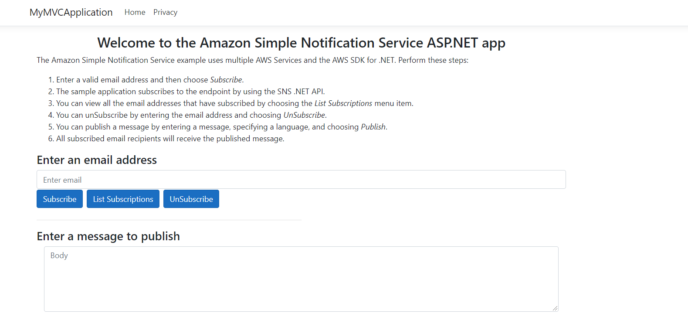

# Creating a publish/subscription web application that translates messages using the AWS SDK for .NET

## Purpose

You can create a web application that has subscription and publish functionality by using the Amazon Simple Notification Service (Amazon SNS) and the AWS SDK for .NET. The application created in this AWS tutorial is a .NET MVC application that lets a user subscribe to an Amazon SNS topic by entering a valid email address. A user can enter many emails and all of them are subscribed to the given SNS topic (once the email recipients confirm the subscription). The user can publish a message that results in all subscribed emails receiving the message. 

**Note**: Amazon SNS is a managed service that provides message delivery from publishers to subscribers (also known as producers and consumers). For more information, see [What is Amazon SNS?](https://docs.aws.amazon.com/sns/latest/dg/welcome.html)


#### Topics

+ Prerequisites
+ Understand the Publish/Subscription application
+ Create an IntelliJ project 
+ Add the POM dependencies to your project
+ Create the Java classes
+ Create the HTML files
+ Package the application into a JAR file
+ Deploy the application to Elastic Beanstalk

## Prerequisites

To complete the tutorial, you need the following:

+ An AWS account
+ A Java IDE (this tutorial uses the IntelliJ IDE)
+ Java JDK 1.8
+ Maven 3.6 or later

## Important

+ The AWS services included in this document are included in the [AWS Free Tier](https://aws.amazon.com/free/?all-free-tier.sort-by=item.additionalFields.SortRank&all-free-tier.sort-order=asc).
+  This code has not been tested in all AWS Regions. Some AWS services are available only in specific regions. For more information, see [AWS Regional Services](https://aws.amazon.com/about-aws/global-infrastructure/regional-product-services). 
+ Running this code might result in charges to your AWS account. 
+ Be sure to terminate all of the resources you create while going through this tutorial to ensure that you’re not charged.

### Creating the resources

Create an Amazon SNS queue that is used in the Java code. For information, see [Creating an Amazon SNS topic](https://docs.aws.amazon.com/sns/latest/dg/sns-create-topic.html).

In addition, make sure that you ahve setup your .NET developer environment before following along with this tutorial. For more information, see [Setting up your AWS SDK for .NET environment](https://docs.aws.amazon.com/sdk-for-net/v3/developer-guide/net-dg-setup.html). 

## Understand the Publish/Subscription application

To subscribe to an Amazon SNS topic, the user enters a valid email address into the web application. 


The specified email address recieves an email message that lets the recipient confirm the subscription. 


Once the email recipient accepts the confirmation, that email is subscribed to the specific SNS topic and recieves published messages. To publish a message, a user enters the message into the web application and then chooses the **Publish** button. 


This application lets a user specify the language of the message that is sent. For example, the user can select **French** from the dropdown field and then the message appears in that language to all subscribed users. 


**Note**: The Amazon Translate Service is used to translate the body of the message. The code is shown later in this document. 

This example application lets you view all of the subscribed email recipients by choosing the **List Subscriptions** button, as shown in the following illustration.


## Create a .NET Web App project

Create a Net Web App project using Visual Studio named **SNSApplication**.


1. In Visual Studio, choose **File**, **New**, **Project**.

2. In the New Project dialog box, choose **ASP .NET Core Web App**.

3. Choose **Next**.

4. In the **Project Name** field, specify **SNSApplication**.  

5. Choose **Next**.

6. Choose **Create**.

## Add the required AWS Packages to your project

At this point, you have a new project named **SNSApplication**. You must add the required AWS packages to your project, as shown in this illustration.


Once you add these packages, you can use the AWS SDK for .NET in your project. 

1. In the Solution Explorer, right click **Packages**.

2. Select **Manage NuGet Packages**.

3. Choose **Browse**.

4. In the **Search** field, specify **AWSSDK.Core**.  

5. Choose **Next**.

6. Choose **Download**.

**Note**: Repeat this process for the **AWSSDK.Simplenotificationservice** and **AWSSDK.Translate** packages. 

**Tip**: If you do not see these AWS Packages, then ensure that your NuGet is properly configured to use **nuget.org**, as shown in this illustration. 


 ## Create the .NET classes
 
 By default, most of the .NET classes that you use to build this AWS application are created. Notice the project structure of your application. 
 
 
 
 You work with these .NET classes:

+ **HomeController** - Used as the .NET controller that handles HTTP requests. 
+ **SnsService** - Used to invoke Amazon SNS operations by using the Amazon SNS .NET API This also uses the Amazon Translate API to translate messages. You need to create this class in the same location as the **HomeController**. 

### HomeController class

The following C# code represents the **HomeController** class. Becasue the Async version of the AWS SDK for .NET is used, notice that the controller methods have to use **async** keywords and the return values are defined using **Task**. 

```csharp
     using Microsoft.AspNetCore.Mvc;
     using Microsoft.Extensions.Logging;
     using MyMVCApplication.Models;
     using System;
     using System.Diagnostics;
     using System.Threading.Tasks;

     namespace MyMVCApplication.Controllers
    {
    
     public class HomeController : Controller
     {
        private readonly ILogger<HomeController> _logger;

        public HomeController(ILogger<HomeController> logger)
        {
            _logger = logger;
        }

        [HttpPost]
        public async Task<ActionResult> PublishMessage(String body, String lang)
        {
            var snsService = new SnsService();
            var bodyValue = body;
            var langValue = lang;
            var id = await snsService.pubTopic(body, lang);
            return Content("Message " +id +" was successfully published");
        }


        [HttpPost]
        public async Task<ActionResult> RemoveEmailSub(string email)
        {

            var snsService = new SnsService();
            var emailValue = email;
            var msg = await snsService.UnSubEmail(email);
            return Content(msg);
        }

        [HttpPost]
        public async Task<ActionResult> AddEmailSub(string email)
        {

            var snsService = new SnsService();
            var emailValue = email;
            var arn = await snsService.subEmail(email);
            return Content(arn);
        }


        [HttpGet]
        public async Task<ActionResult> GetAjaxValue() 
        {

            var snsService = new SnsService();
            var xml = await snsService.getSubs();
            return Content(xml);
        }

        public IActionResult Index()
        {
            return View();
        }

        public IActionResult Privacy()
        {
            return View();
        }

        [ResponseCache(Duration = 0, Location = ResponseCacheLocation.None, NoStore = true)]
        public IActionResult Error()
        {
            return View(new ErrorViewModel { RequestId = Activity.Current?.Id ?? HttpContext.TraceIdentifier });
        }
      }
     }

```

### SnsService class

The following C# code represents the **SnsService** class. This class uses the AWS .NET SNS API to interact with Amazon SNS. For example, the **subEmail** method uses the email address to subscribe to the Amazon SNS topic. Likewise, the **unSubEmail** method unsubscibes from the Amazon SNS topic. The **pubTopic** publishes a message. The **TranslateBody** method uses the Amazon Translate Service to translate the message if requested by the user.  

```csharp
     
    using System;
    using System.Threading;
    using System.Collections.Generic;
    using System.Threading.Tasks;
    using Amazon.SimpleNotificationService;
    using Amazon.SimpleNotificationService.Model;
    using Amazon.Translate;
    using Amazon.Translate.Model;
    using System.Xml;
    using Amazon;

    namespace MyMVCApplication.Controllers
   {
   
    public class SnsService
    {

        private static String topicArn = <ENTER YOUR TOPIC ARN>";

        public async Task<String> UnSubEmail(String email)
        {

            var client = new AmazonSimpleNotificationServiceClient();
            var arnValue = await GetSubArn(client, email);
            await RemoveSub(client, arnValue);
            return email + " was successfully deleted!";
        }

        public async Task<String> pubTopic(String body, String lang)
        {
            var client = new AmazonSimpleNotificationServiceClient();
            var message = "";

            if (lang.Equals("French"))
                message = TranslateBody(body, "fr");
            else if (lang.Equals("Spanish"))
                message = TranslateBody(body, "es");
            else
                message = body; 

            var msgId = await PublishMessage(client, message);
            return msgId;
        }


        public async Task<String> subEmail(String email)
        {
            var client = new AmazonSimpleNotificationServiceClient();
            var subArn = await SubscribeEmail(client, email);
            return subArn;
        }


        public async Task<String> getSubs()
        {
            var client = new AmazonSimpleNotificationServiceClient();
            var subscriptions = await GetSubscriptionsListAsync(client);
            var val = DisplaySubscriptionList(subscriptions);
            return val;
        }

        public static async Task<String> RemoveSub(IAmazonSimpleNotificationService client, String subArn)
        {
            var request = new UnsubscribeRequest();
            request.SubscriptionArn = subArn;
            var cancelToken = new CancellationToken();
            await client.UnsubscribeAsync(request, cancelToken);

            return "";//response.MessageId;
        }

        public static async Task<String> GetSubArn(IAmazonSimpleNotificationService client, String email)
        {
            var request = new ListSubscriptionsByTopicRequest();
            request.TopicArn = topicArn;
            var subArn = "";

            var cancelToken = new CancellationToken();
            var response = await client.ListSubscriptionsByTopicAsync(request, cancelToken);
            List<Subscription> allSubs = response.Subscriptions;

            // Get the ARN Value for this subscription.
            foreach (Subscription sub in allSubs)
            {
                if (sub.Endpoint.Equals(email))
                {
                    subArn = sub.SubscriptionArn;
                    return subArn;

                }
            }
            return "";
        }

        public static async Task<String> PublishMessage(IAmazonSimpleNotificationService client, String body)
        {
            var request = new PublishRequest();
            request.Message = body;
            request.TopicArn = topicArn;
           
            var cancelToken = new CancellationToken();
            var response = await client.PublishAsync(request, cancelToken);

            return response.MessageId;
        }


        public static async Task<String> SubscribeEmail(IAmazonSimpleNotificationService client, String email)
        {
            var request = new SubscribeRequest();
            request.Protocol = "email";
            request.Endpoint = email;
            request.TopicArn = topicArn;
            request.ReturnSubscriptionArn = true;

            var cancelToken = new CancellationToken();
            var response = await client.SubscribeAsync(request, cancelToken);
            
            return response.SubscriptionArn;
        }


        public static async Task<List<Subscription>> GetSubscriptionsListAsync(IAmazonSimpleNotificationService client)
        {
            var request = new ListSubscriptionsByTopicRequest();
            var cancelToken = new CancellationToken();
            var response = await client.ListSubscriptionsByTopicAsync(topicArn, "", cancelToken);
            return response.Subscriptions;
        }

     
        public String DisplaySubscriptionList(List<Subscription> subscriptionList)
        {

            var email = ""; 
            List<String> emailList = new List<string>();
            foreach (var subscription in subscriptionList)
            {
                emailList.Add(subscription.Endpoint);
            }

            var xml = GenerateXML(emailList);
            return xml; 
        }

        // Convert the list to XML to pass back to the view.
        private String GenerateXML(List<string> subsList)
        {
            XmlDocument doc = new XmlDocument();
            XmlNode docNode = doc.CreateXmlDeclaration("1.0", "UTF-8", null);
            doc.AppendChild(docNode);

            XmlNode subsNode = doc.CreateElement("Subs");
            doc.AppendChild(subsNode);

            // Iterate through the collection.
            foreach (String sub in subsList)
            {

                XmlNode subNode = doc.CreateElement("Sub");
                subsNode.AppendChild(subNode);

                XmlNode email = doc.CreateElement("email");
                email.AppendChild(doc.CreateTextNode(sub));
                subNode.AppendChild(email);
            }

           return doc.OuterXml; 
        }
    
        
        private String TranslateBody(String msg, String lan)
        {
            var translateClient = new AmazonTranslateClient(RegionEndpoint.USEast2);
            var request = new TranslateTextRequest();
            request.SourceLanguageCode = "en" ;
            request.TargetLanguageCode= lan;
            request.Text = msg;
            var response = translateClient.TranslateTextAsync(request);
            return response.Result.TranslatedText; 
        }
       }
     }


```

**Note:** Make sure that you assign the SNS topic ARN to the **topicArn** data member. Otherwise, your code does not work. 

## Modify the cshtml file

At this point, you have created all of the .NET classes required for this example application. Now modify the index.cshtml file required for the application's view. This file exists in the Views/Home folder, as shown in this illustration. 


### cshtml.html
The **cshtml.html** file is the application's home view. 

```html
 @{
    ViewData["Title"] = "Home Page";
}

<div class="text-center">
   
    <h3>Welcome to the Amazon  Simple Notification Service ASP.NET app</h3>
</div>

<div class="container">

    <div>
        <p>The Amazon Simple Notification Service example uses multiple AWS Services and the AWS SDK for .NET. Perform these steps:<p>
            <ol>
                <li>Enter a valid email address and then choose <i>Subscribe</i>.</li>
                <li>The sample application subscribes to the endpoint by using the SNS .NET API.</li>
                <li>You can view all the email addresses that have subscribed by choosing the <i>List Subscriptions</i> menu item.</li>
                <li>You can unSubscribe by entering the email address and choosing <i>UnSubscribe</i>. </li>
                <li>You can publish a message by entering a message, specifying a language, and choosing <i>Publish</i>.
                <li>All subscribed email recipients will receive the published message.</li>
            </ol>
    </div>
     <div class="row">
        <div class="col">
            <h4>
                Enter an email address<h3>
                    <input type="email" class="form-control" id="inputEmail1" aria-describedby="emailHelp" placeholder="Enter email">
                    <div class="clearfix mt-40">

                        <!-- Button trigger modal -->
                        <button type="button" onclick="subEmail() " class="btn btn-primary">
                            Subscribe
                        </button>
                        <button type="button" class="btn btn-primary" onclick="subscribe()">
                            List Subscriptions
                        </button>
                        <button type="button" onclick="delSub()" class="btn btn-primary">
                            UnSubscribe
                        </button>

                        <!-- Modal -->
                        <div class="modal fade" id="myModal" tabindex="-1" role="dialog" aria-labelledby="exampleModalLongTitle" aria-hidden="true">
                            <div class="modal-dialog" role="document">
                                <div class="modal-content">
                                    <div class="modal-header">
                                        <h5 class="modal-title" id="exampleModalLongTitle">SNS Email Subscriptions</h5>
                                        <button type="button" class="close" data-dismiss="modal" aria-label="Close">
                                            <span aria-hidden="true">&times;</span>
                                        </button>
                                    </div>
                                    <div class="modal-body">

                                    </div>
                                    <div class="modal-footer">
                                        <button type="button" class="btn btn-secondary" data-dismiss="modal">Close</button>
                                    </div>
                                </div>
                            </div>
                        </div>
                    </div>
        </div>
    </div>
    <hr style="width:50%;text-align:left;margin-left:0">
    <h4>Enter a message to publish</h4>
    <div class="col-lg-12 mx-auto">
        <div class="control-group">
            <div class="form-group floating-label-form-group controls mb-0 pb-2">
                <textarea class="form-control" id="body" rows="5" placeholder="Body" required="required" data-validation-required-message="Please enter a description."></textarea>
                <p class="help-block text-danger"></p>
            </div>
        </div>
        <br>
        <div>
            <label for="lang">Select a Language:</label>
            <select name="lang" id="lang">
                <option>English</option>
                <option>French</option>
                <option>Spanish</option>
            </select>
        </div>
        <button type="submit" class="btn btn-primary btn-xl" id="SendButton">Publish</button>
    </div>
</div>
```
  	


### Create the JS File

This application has a **contact_me.js** file that is used to send requests to the Spring Controller. Place this file in the **resources\public\js** folder. 

```javascript
    $(function() {
    $("#SendButton" ).click(function($e) {

        var body = $('#body').val();
        var lang = $('#lang option:selected').text();
        if (body == '' ){
            alert("Please enter text");
            return;
        }

        $.ajax('/addMessage', {
            type: 'POST',
            data: 'lang=' + lang+'&body=' + body,
            success: function (data, status, xhr) {

                alert(data)
                $('#body').val("");
            },
            error: function (jqXhr, textStatus, errorMessage) {
                $('p').append('Error' + errorMessage);
            }
        });
      } );
    } );
    
    function subEmail(){
     var mail = $('#inputEmail1').val();
     var result = validate(mail)
     if (result == false) {
        alert (mail + " is not valid. Please specify a valid email.");
        return;
     }

     $.ajax('/addEmail', {
        type: 'POST',
        data: 'email=' + mail,
        success: function (data, status, xhr) {
            alert("Subscription validation is "+data)
        },
        error: function (jqXhr, textStatus, errorMessage) {
            $('p').append('Error' + errorMessage);
        }
      });
     }

     function getSubs() {
      $.ajax('/getSubs', {
        type: 'GET', 
        success: function (data, status, xhr) {

            $('.modal-body').empty();
            var xml = data;
            $(xml).find('Sub').each(function ()  {

                var $field = $(this);
                var email = $field.find('email').text();

                // Append this data to the main list.
                $('.modal-body').append("<p><b>"+email+"</b></p>");
            });
            $("#myModal").modal();
        },
        error: function (jqXhr, textStatus, errorMessage) {
            $('p').append('Error' + errorMessage);
        }
       });
      }

     function delSub(event) {
       var mail = $('#inputEmail1').val();
       var result = validate(mail)

      if (result == false) {
       alert (mail + " is not valid. Please specify a valid email");
       return;
      }

     $.ajax('/delSub', {
        type: 'POST',  // http GET method
        data: 'email=' + mail,
        success: function (data, status, xhr) {

            alert("Subscription validation is "+data);
        },
        error: function (jqXhr, textStatus, errorMessage) {
            $('p').append('Error' + errorMessage);
        }
      });
    }

     function validateEmail(email) {
       const re = /^(([^<>()[\]\\.,;:\s@\"]+(\.[^<>()[\]\\.,;:\s@\"]+)*)|(\".+\"))@((\[[0-9]{1,3}\.[0-9]{1,3}\.[0-9]{1,3}\.[0-9]{1,3}\])|(([a-zA-Z\-0-9]+\.)+[a-zA-Z]{2,}))$/;
       return re.test(email);
      }

     function validate(email) {
      const $result = $("#result");

     if (validateEmail(email)) {
        return true ;
      } else {
        return false ;
     }
    }
 ```

## Run the application

Using Visual Studio, you can run your application. After it starts, you will see the HOME page, as shown in this illustration. 




### Next steps
Congratulations! You have created a Spring Boot application that contains subscription and publish functionality. As stated at the beginning of this tutorial, be sure to terminate all of the resources you create while going through this tutorial to ensure that you’re not charged.

For more AWS multiservice examples, see
[usecases](https://github.com/awsdocs/aws-doc-sdk-examples/tree/master/javav2/usecases).

