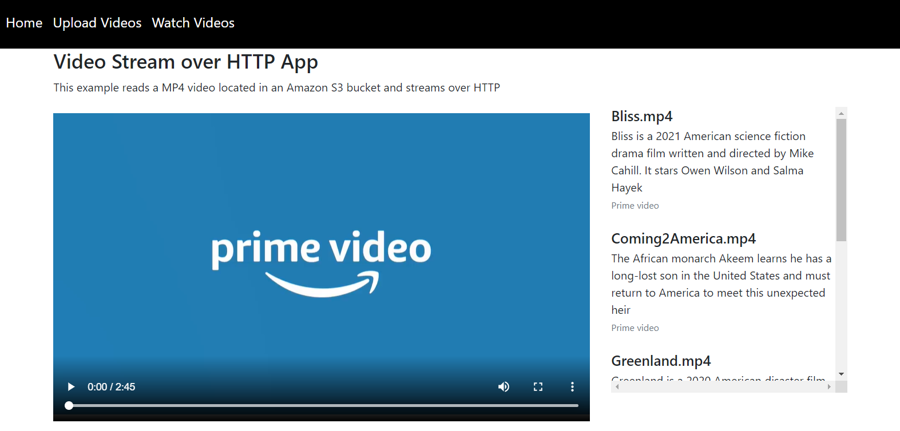
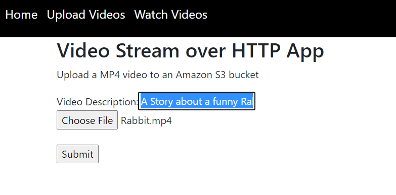
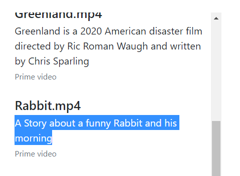
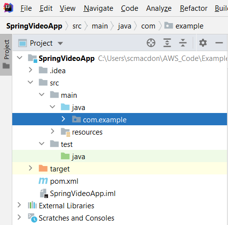
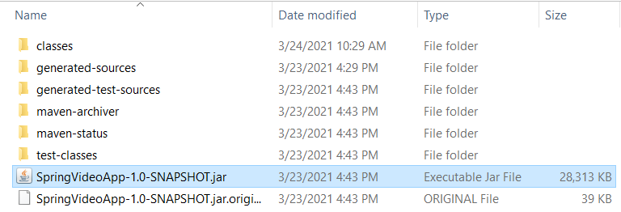

# Building a Spring Boot web application that Streams Amazon S3 content over HTTP

You can use Amazon Web Services to create a web application that streams video content that is read from an Amazon S3 bucket over HTTP. The video is displayed in the application’s view. In this tutorial, the Spring Framework along with AWS SDK for Java API is used to create the application. 

This web application also reads the object tags to dynamically build the video menu displayed in the web application. To read the video content and object tags, the Amazon S3 Java API is used.  

In the previous illustration, notice the video menu that displays video titles and descriptions. The video menu is displayed to let the user know which videos are available to view. To view a specific video, the user click the video title. A GET Request is made to a Spring Controller, the application reads the specific video in an Amazon S3 bucket, encodes the byte array and then steams the data where the video is displayed in an HTML5 Video tag. 

This web application also supports uploading MP4 videos to an Amazon S3 bucket. For example, the following illustration shows a video named Rabbit.mp4 along with a description. 

Once a video is uploaded into the Amazon S3 bucket, it is displayed in the video menu. 

In this AWS tutorial, you create a Spring Boot web application. After the application is created, this tutorial shows you how to deploy the application to AWS Elastic Beanstalk. 

**Cost to complete:** The AWS services included in this document are included in the [AWS Free Tier](https://aws.amazon.com/free/?all-free-tier.sort-by=item.additionalFields.SortRank&all-free-tier.sort-order=asc).

**Note:** Be sure to terminate all of the resources you create while going through this tutorial to ensure that you’re no longer charged for them.

#### Topics

+ Prerequisites
+ Create an IntelliJ project 
+ Add the POM dependencies to your project
+ Set up the Java packages in your project
+ Create the Java classes
+ Create the HTML files
+ Package the application into a JAR file
+ Deploy the application to Elastic Beanstalk

## Prerequisites

To complete the tutorial, you need the following:

+ An AWS account
+ A Java IDE (this tutorial uses the IntelliJ IDE)
+ Java JDK 1.8
+ Maven 3.6 or later
+ An Amazon S3 bucket that contains 3-5 MP4 files. 

## Create an IntelliJ project named SpringVideoApp

Create an IntelliJ project that is used to create the web application that streams Amazon S3 video content.

1. In the IntelliJ IDE, choose **File**, **New**, **Project**.

2. In the New Project dialog box, choose **Maven**.

3. Choose **Next**.

4. In **GroupId**, enter **spring-aws**.

5. In **ArtifactId**, enter **SpringVideoApp**.

6.	Choose **Next**.

7.	Choose **Finish**.

## Add the Spring POM dependencies to your project

At this point, you have a new project named **SpringVideoApp**. Ensure that the pom.xml file resembles the following code.

     <?xml version="1.0" encoding="UTF-8"?>
     <project xmlns="http://maven.apache.org/POM/4.0.0"
         xmlns:xsi="http://www.w3.org/2001/XMLSchema-instance"
         xsi:schemaLocation="http://maven.apache.org/POM/4.0.0 http://maven.apache.org/xsd/maven-4.0.0.xsd">
    <modelVersion>4.0.0</modelVersion>
    <groupId>org.example</groupId>
    <artifactId>SpringVideoApp</artifactId>
    <version>1.0-SNAPSHOT</version>
    <packaging>jar</packaging>
    <description>Demo project for Spring Boot</description>
    <parent>
        <groupId>org.springframework.boot</groupId>
        <artifactId>spring-boot-starter-parent</artifactId>
        <version>2.3.0.RELEASE</version>
        <relativePath/> <!-- lookup parent from repository -->
    </parent>
    <properties>
        <java.version>1.8</java.version>
    </properties>
    <dependencyManagement>
        <dependencies>
            <dependency>
                <groupId>software.amazon.awssdk</groupId>
                <artifactId>bom</artifactId>
                <version>2.10.54</version>
                <type>pom</type>
                <scope>import</scope>
            </dependency>
        </dependencies>
    </dependencyManagement>
    <dependencies>
        <dependency>
            <groupId>org.springframework.boot</groupId>
            <artifactId>spring-boot-starter-thymeleaf</artifactId>
        </dependency>
        <dependency>
            <groupId>software.amazon.awssdk</groupId>
            <artifactId>s3</artifactId>
        </dependency>
        <dependency>
            <groupId>org.springframework.boot</groupId>
            <artifactId>spring-boot-starter-web</artifactId>
        </dependency>
        <dependency>
            <groupId>commons-io</groupId>
            <artifactId>commons-io</artifactId>
            <version>2.6</version>
        </dependency>
           <dependency>
            <groupId>io.projectreactor</groupId>
            <artifactId>reactor-core</artifactId>
            <version>3.4.4</version>
        </dependency>

        <dependency>
            <groupId>org.springframework.boot</groupId>
            <artifactId>spring-boot-starter-test</artifactId>
            <scope>test</scope>
            <exclusions>
                <exclusion>
                    <groupId>org.junit.vintage</groupId>
                    <artifactId>junit-vintage-engine</artifactId>
                </exclusion>
            </exclusions>
        </dependency>
    </dependencies>
    <build>
        <plugins>
            <plugin>
                <groupId>org.springframework.boot</groupId>
                <artifactId>spring-boot-maven-plugin</artifactId>
            </plugin>
        </plugins>
    </build>
</project>
     
 ## Create the Java classes
 
 Create a Java package in the main/java folder named **com.example**. This Java classes go into this package. 
 
 
 
 Create these Java classes:

+ **Application** - Used as the base class for the Spring Boot application.
+ **Tags** - Used to store tag information. 
+ **VideoStreamController** - Used as the Spring Boot controller that handles HTTP requests.
+ **VideoStreamService** - Used as the Spring Service that uses the Amazon S3 Java API. 

### Application class

The following Java code represents the **Application** class.

     package com.example;

      import org.springframework.boot.SpringApplication;
      import org.springframework.boot.autoconfigure.SpringBootApplication;
      import org.springframework.boot.autoconfigure.security.servlet.SecurityAutoConfiguration;

      @SpringBootApplication(exclude = {SecurityAutoConfiguration.class })
      public class Application {

      public static void main(String[] args) {
        SpringApplication.run(Application.class, args);
      }
    }

### Tags class

The following Java code represents the **Tags** class.

     package com.example;

    public class Tags {

     private String name;
     private String description;

     public String getDesc() {
        return this.description ;
     }

     public void setDesc(String description){
        this.description = description;
     }

     public String getName() {
        return this.name ;
     }

     public void setName(String name){
        this.name = name;
     }
    }

### VideoStreamController class

The following Java code represents the **VideoStreamController** class.

    package com.example;

    import org.springframework.beans.factory.annotation.Autowired;
    import org.springframework.http.ResponseEntity;
    import org.springframework.stereotype.Controller;
    import org.springframework.web.bind.annotation.*;
    import org.springframework.web.multipart.MultipartFile;
    import org.springframework.web.servlet.ModelAndView;
    import org.springframework.web.servlet.view.RedirectView;
    import reactor.core.publisher.Mono;
    import javax.servlet.http.HttpServletRequest;
    import javax.servlet.http.HttpServletResponse;
    import java.io.IOException;

    @Controller
    public class VideoStreamController {

    @Autowired
    VideoStreamService vid;

    private String bucket = "<Enter your bucket name>";

    @RequestMapping(value = "/")
    public String root() {
        return "index";
    }

    @GetMapping("/watch")
    public String designer() {
        return "video";
    }

    @GetMapping("/upload")
    public String upload() {
        return "upload";
    }

    // Upload a MP4 to an Amazon S3 bucket
    @RequestMapping(value = "/fileupload", method = RequestMethod.POST)
    @ResponseBody
    public ModelAndView singleFileUpload(@RequestParam("file") MultipartFile file, @RequestParam String description) {

        try {
            byte[] bytes = file.getBytes();
            String name =  file.getOriginalFilename() ;
            String desc2 =  description ;

            // Put the MP4 file into an Amazon S3 bucket
            vid.putVideo(bytes, bucket, name, desc2);

        } catch (IOException e) {
            e.printStackTrace();
        }
        return new ModelAndView(new RedirectView("upload"));
     }

    // Returns items to populate the Video menu
    @RequestMapping(value = "/items", method = RequestMethod.GET)
    @ResponseBody
    public String getItems(HttpServletRequest request, HttpServletResponse response) {

        String xml = vid.getTags(bucket);
        return xml;
    }

    // Returns the video in the bucket specified by the ID value
    @RequestMapping(value = "/{id}/stream", method = RequestMethod.GET)
    public Mono<ResponseEntity<byte[]>> streamVideo(@PathVariable String id) {

        String fileName = id;
        return Mono.just(vid.getObjectBytes(bucket, fileName));
     }
    }

**Note**: Make sure that you assign an Amazon S3 bucket name to the **bucket** variable.  

### VideoStreamService class

The following Java code represents the **VideoStreamService** class. This class uses the Amazon S3 Java API (V2) to interact with content located in an S3 bucket. For example, the **getTags** method returns a collection of tags that are used to create the video menu. Likewise, the **getObjectBytes** reads bytes from a MP4 video. 

     package com.example;

     import org.slf4j.Logger;
     import org.slf4j.LoggerFactory;
     import org.springframework.http.HttpStatus;
     import org.springframework.http.ResponseEntity;
     import org.springframework.stereotype.Service;
     import software.amazon.awssdk.auth.credentials.EnvironmentVariableCredentialsProvider;
     import software.amazon.awssdk.core.ResponseBytes;
     import software.amazon.awssdk.core.sync.RequestBody;
     import software.amazon.awssdk.regions.Region;
     import software.amazon.awssdk.services.s3.S3Client;
     import software.amazon.awssdk.services.s3.model.*;
     import org.w3c.dom.Document;
     import javax.xml.parsers.DocumentBuilder;
     import javax.xml.parsers.DocumentBuilderFactory;
     import org.w3c.dom.Element;
     import javax.xml.parsers.ParserConfigurationException;
     import javax.xml.transform.Transformer;
     import javax.xml.transform.TransformerException;
     import javax.xml.transform.TransformerFactory;
     import javax.xml.transform.dom.DOMSource;
     import javax.xml.transform.stream.StreamResult;
     import java.io.StringWriter;
     import java.util.*;

    @Service
    public class VideoStreamService {

    public static final String VIDEO = "/video";

    public static final String CONTENT_TYPE = "Content-Type";
    public static final String CONTENT_LENGTH = "Content-Length";
    public static final String VIDEO_CONTENT = "video/";
    public static final String CONTENT_RANGE = "Content-Range";
    public static final String ACCEPT_RANGES = "Accept-Ranges";
    public static final String BYTES = "bytes";
    public static final int BYTE_RANGE = 1024;

    private final Logger logger = LoggerFactory.getLogger(this.getClass());
    S3Client s3 ;

    private S3Client getClient() {
        // Create the S3Client object
        Region region = Region.US_WEST_2;
        S3Client s3 = S3Client.builder()
                .credentialsProvider(EnvironmentVariableCredentialsProvider.create())
                .region(region)
                .build();

        return s3;
    }

    // Places a new video into an Amazon S3 bucket
    public void putVideo(byte[] bytes, String bucketName, String fileName, String description) {
        s3 = getClient();

        try {

            // Set the tags to apply to the object
            String theTags = "name="+fileName+"&description="+description;

            PutObjectRequest putOb = PutObjectRequest.builder()
                    .bucket(bucketName)
                    .key(fileName)
                    .tagging(theTags)
                    .build();

            s3.putObject(putOb, RequestBody.fromBytes(bytes));

        } catch (S3Exception e) {
            System.err.println(e.awsErrorDetails().errorMessage());
            System.exit(1);
        }
    }

    // Returns a schema that describes all tags for all videos in the given bucket
    public String getTags(String bucketName){
        s3 = getClient();

        List tagList   ;

      try {

          ListObjectsRequest listObjects = ListObjectsRequest
                  .builder()
                  .bucket(bucketName)
                  .build();

          ListObjectsResponse res = s3.listObjects(listObjects);
          List<S3Object> objects = res.contents();

          Tags myTag ;
          ArrayList keys = new ArrayList<String>();

          for (ListIterator iterVals = objects.listIterator(); iterVals.hasNext(); ) {
              S3Object myValue = (S3Object) iterVals.next();
              String key = myValue.key(); // We need the key to get the tags

              //Get the tags
              GetObjectTaggingRequest getTaggingRequest = GetObjectTaggingRequest
                      .builder()
                      .key(key)
                      .bucket(bucketName)
                      .build();

              GetObjectTaggingResponse tags = s3.getObjectTagging(getTaggingRequest);
              List<Tag> tagSet= tags.tagSet();

              // Write out the tags
              Iterator<Tag> tagIterator = tagSet.iterator();
              while(tagIterator.hasNext()) {
                  myTag = new Tags();
                  Tag tag = (Tag)tagIterator.next();
                  keys.add(tag.value());

                }
          }

          tagList = modList(keys);
          return convertToString(toXml(tagList));

    } catch (S3Exception e) {
        System.err.println(e.awsErrorDetails().errorMessage());
        System.exit(1);
    }
        return "";
    }

    // We need to modify the list
    private List modList(List<String> myList){

        // Get the elements from the collection.
        int count = myList.size();
        List allTags = new ArrayList<Tags>();
        Tags myTag ;
        ArrayList keys = new ArrayList<String>();
        ArrayList values = new ArrayList<String>();

        for ( int index=0; index < count; index++) {

            if (index % 2 == 0)
                keys.add(myList.get(index));
            else
                values.add(myList.get(index));
          }

           // Combine these lists.
           int size =  keys.size();
           for (int r=0; r<size; r++){

               myTag = new Tags();
               myTag.setName(keys.get(r).toString());
               myTag.setDesc(values.get(r).toString());
               allTags.add(myTag);
           }

        return allTags;
    }

    // Reads a video from a bucket and returns a byte streeam
    public ResponseEntity<byte[]> getObjectBytes (String bucketName, String keyName) {

        s3 = getClient();

        try {
            // create a GetObjectRequest instance
            GetObjectRequest objectRequest = GetObjectRequest
                    .builder()
                    .key(keyName)
                    .bucket(bucketName)
                    .build();

            // get the byte[] from this AWS S3 object.
            ResponseBytes<GetObjectResponse> objectBytes = s3.getObjectAsBytes(objectRequest);
            return ResponseEntity.status(HttpStatus.OK)
                    .header(CONTENT_TYPE, VIDEO_CONTENT + "mp4")
                    .header(CONTENT_LENGTH, String.valueOf(objectBytes.asByteArray().length))
                    .body(objectBytes.asByteArray());

        } catch (S3Exception e) {
            System.err.println(e.awsErrorDetails().errorMessage());
            System.exit(1);
        }
        return null;
    }

    // Convert a LIST to XML data.
     private Document toXml(List<Tags> itemList) {

        try {
            DocumentBuilderFactory factory = DocumentBuilderFactory.newInstance();
            DocumentBuilder builder = factory.newDocumentBuilder();
            Document doc = builder.newDocument();

            // Start building the XML
            Element root = doc.createElement( "Tags" );
            doc.appendChild( root );

            // Get the elements from the collection
            int count = itemList.size();

            // Iterate through the list.
            for (Tags myItem: itemList) {

                Element item = doc.createElement( "Tag" );
                root.appendChild( item );

                // Set Id
                Element id = doc.createElement( "Name" );
                id.appendChild( doc.createTextNode(myItem.getName() ) );
                item.appendChild( id );

                // Set Name
                Element name = doc.createElement( "Description" );
                name.appendChild( doc.createTextNode(myItem.getDesc() ) );
                item.appendChild( name );
            }

            return doc;
        } catch(ParserConfigurationException e) {
            e.printStackTrace();
        }
        return null;
    }

    private String convertToString(Document xml) {
        try {
            Transformer transformer = TransformerFactory.newInstance().newTransformer();
            StreamResult result = new StreamResult(new StringWriter());
            DOMSource source = new DOMSource(xml);
            transformer.transform(source, result);
            return result.getWriter().toString();

        } catch(TransformerException ex) {
            ex.printStackTrace();
        }
        return null;
     }
    }

## Create the HTML file

At this point, you have created all of the Java files required for this example Spring Boot application. Now you create a HTML file that are required for the application's view. Under the resource folder, create a **templates** folder, and then create the following HTML file:

+ index.html
+ layout.html
+ upload.html
+ video.html

### index.html
The **index.html** file is the application's home view. The following HTML represents the **index.html** file. 

     <!DOCTYPE HTML>
     <html xmlns:th="https://www.thymeleaf.org">
     <meta charset="utf-8" />
     <meta http-equiv="X-UA-Compatible" content="IE=edge" />
     <meta name="viewport" content="width=device-width, initial-scale=1" />

    <link rel="stylesheet" href="https://maxcdn.bootstrapcdn.com/bootstrap/4.0.0/css/bootstrap.min.css" integrity="sha384-Gn5384xqQ1aoWXA+058RXPxPg6fy4IWvTNh0E263XmFcJlSAwiGgFAW/dAiS6JXm" crossorigin="anonymous">
    <link rel="stylesheet" href="../public/css/styles.css" th:href="@{/css/styles.css}" />
    <link rel="icon" href="../public/img/favicon.ico" th:href="@{/img/favicon.ico}" />

    <title>AWS Item Tracker</title>
    </head>

    <body>
    <header th:replace="layout :: site-header"></header>
    

    <h2>Video Stream over HTTP App</h2>

    
The AWS Item Tracker application is a sample application that uses multiple AWS Services and the Java V2 API. Collecting and working with items has never been easier! Simply perform these steps:

    <ol>
        <li>Enter work items into the system by choosing the <i>Add Items</i> menu item. Fill in the form and then choose <i>Create Item</i>.</li>
        <li>The AWS Item Tracker application stores the data by using the Amazon Relational Database Service (Amazon RDS).</li>
        <li>You can view all of your items by choosing the <i>Get Items</i> menu item. Next, choose <i>Get Active Items</i> in the dialog box.</li>
        <li>You can modify an Active Item by selecting an item in the table and then choosing <i>Get Single Item</i>. The item appears in the Modify Item section where you can modify the description or status.</li>
        <li>Modify the item and then choose <i>Update Item</i>. You cannot modify the ID value. </li>
        <li>You can archive any item by selecting the item and choosing <i>Archive Item</i>. Notice that the table is updated with only active items.</li>
        <li>You can display all archived items by choosing <i>Get Archived Items</i>. You cannot modify an archived item.</li>
        <li>You can send an email recipient an email message with a report attachment by selecting the email recipient from the dialog box and then choosing <i>Send Report</i>.Only Active data is sent in a report.</li>
        <li>The Amazon Simple Email Service is used to send an email with an Excel document to the selected email recipient.</li>
    </ol>
    

    </body>
    </html>

### layout.html
The following code represents the **layout.html** file that represents the application's menu.

     <!DOCTYPE html>
     <html xmlns:th="http://www.thymeleaf.org">
     <head th:fragment="site-head">
     <meta charset="UTF-8" />
     <link rel="icon" href="../public/images/favicon.ico" th:href="@{/images/favicon.ico}" />
     
     <meta th:include="this :: head" th:remove="tag"/>
     </head>
     <body>
     <!-- th:hef calls a controller method - which returns the view -->
    <header th:fragment="site-header">
    
    <a href="#" style="color: white" th:href="@{/}">Home</a>
    <a href="#" style="color: white" th:href="@{/upload}">Upload Videos</a>
    <a href="#"  style="color: white" th:href="@{/watch}">Watch Videos</a>
    

        <form method="post" th:action="@{/logout}">
            <input type="submit"  value="Logout"/>
        </form>
    

    </header>
    <h1>Welcome</h1>
    </body>
    </html>

### upload.html
The **upload.html** file is the application's view that lets users upload a MP4 file. 

     <!DOCTYPE html>
     <html xmlns:th="http://www.thymeleaf.org">
     <head lang="en">
    <link rel="stylesheet" href="https://maxcdn.bootstrapcdn.com/bootstrap/4.0.0/css/bootstrap.min.css" integrity="sha384-Gn5384xqQ1aoWXA+058RXPxPg6fy4IWvTNh0E263XmFcJlSAwiGgFAW/dAiS6JXm" crossorigin="anonymous">
    
    <link rel="stylesheet" href="../public/css/styles.css" th:href="@{/css/styles.css}" />
    <link rel="icon" href="../public/images/favicon.ico" th:href="@{/images/favicon.ico}" />
    <title>Spring Framework</title>
    </head>
    <body>
    <header th:replace="layout :: site-header"></header>

  
    

        <h2>Video Stream over HTTP App</h2>
        
Upload a MP4 video to an Amazon S3 bucket

        <form method="POST" onsubmit="myFunction()" action="/fileupload" enctype="multipart/form-data">
            Video Description:<input type="text" name="description" required> 
            <input type="file" name="file" />  
            <input type="submit" value="Submit" />
        </form>
    

    </body>
    </html>

### video.html
The **video.html** file is the application's view that displays both the video menu and the video content. 

     <!DOCTYPE html>
     <html xmlns:th="http://www.thymeleaf.org">
     <head lang="en">
     <link rel="stylesheet" href="https://maxcdn.bootstrapcdn.com/bootstrap/4.0.0/css/bootstrap.min.css" integrity="sha384-Gn5384xqQ1aoWXA+058RXPxPg6fy4IWvTNh0E263XmFcJlSAwiGgFAW/dAiS6JXm" crossorigin="anonymous">
    
    <link rel="stylesheet" href="../public/css/styles.css" th:href="@{/css/styles.css}" />
    <link rel="icon" href="../public/images/favicon.ico" th:href="@{/images/favicon.ico}" />
    <title>Spring Framework</title>

    
      </head>
      <body>
      <header th:replace="layout :: site-header"></header>
      

      <h3>Video Stream over HTTP App</h3>
      
This example reads a MP4 video located in an Amazon S3 bucket and streams over HTTP

      

        

            <video id="video1" width="750" height="440" controls>
                <source type="video/mp4">

                Your browser does not support HTML video.
            </video>
        

        

            

            

        

      

    

    </body>
    </html>

## Create a JAR file for the application

Package up the project into a .jar (JAR) file that you can deploy to Elastic Beanstalk by using the following Maven command.

	mvn package

The JAR file is located in the target folder.

The POM file contains the **spring-boot-maven-plugin** that builds an executable JAR file that includes the dependencies. Without the dependencies, the application does not run on Elastic Beanstalk. For more information, see [Spring Boot Maven Plugin](https://www.baeldung.com/executable-jar-with-maven).

## Deploy the application to Elastic Beanstalk

Sign in to the AWS Management Console, and then open the Elastic Beanstalk console. An application is the top-level container in Elastic Beanstalk that contains one or more application environments (for example prod, qa, and dev, or prod-web, prod-worker, qa-web, qa-worker).

If this is your first time accessing this service, you will see a **Welcome to AWS Elastic Beanstalk** page. Otherwise, you’ll see the Elastic Beanstalk Dashboard, which lists all of your applications.

#### To deploy the DynamoDB Tracker application to Elastic Beanstalk

1. Open the Elastic Beanstalk console at https://console.aws.amazon.com/elasticbeanstalk/home.
2. In the navigation pane, choose  **Applications**, and then choose **Create a new application**. This opens a wizard that creates your application and launches an appropriate environment.
3. On the **Create New Application** page, enter the following values:
   + **Application Name** - DynamoDB Tracker
   + **Description** - A description for the application
4. Choose **Create**.
5. Choose **Create a new environment**.
6. Choose **Web server environment**.
7. Choose **Select**.
8. In the **Environment information** section, leave the default values.
9. In the **Platform** section, choose **Managed platform**.
10. For **Platform**, choose **Java** (accept the default values for the other fields).
11. In the **Application code** section, choose **Upload your code**.
12. Choose **Local file**, and then select **Choose file**. Browse to the JAR file that you created.  
13. Choose **Create environment**. You'll see the application being created.

When you’re done, you will see the application state the **Health** is **Ok** .

14. To change the port that Spring Boot listens on, add an environment variable named **SERVER_PORT**, with the value **5000**.
11. Add a variable named **AWS_ACCESS_KEY_ID**, and then specify your access key value.
12. Add a variable named **AWS_SECRET_ACCESS_KEY**, and then specify your secret key value. After the variables are configured, you'll see the URL for accessing the application.

**Note:** If you don't know how to set variables, see [Environment properties and other software settings](https://docs.aws.amazon.com/elasticbeanstalk/latest/dg/environments-cfg-softwaresettings.html).

To access the application, open your browser and enter the URL for your application. You will see the login page for your application.

### Next steps
Congratulations! You have created a Spring Boot application that uses Amazon Lex to create an interactive user experience. As stated at the beginning of this tutorial, be sure to terminate all of the resources you create while going through this tutorial to ensure that you’re not charged.

For more AWS multiservice examples, see
[usecases](https://github.com/awsdocs/aws-doc-sdk-examples/tree/master/javav2/usecases).
